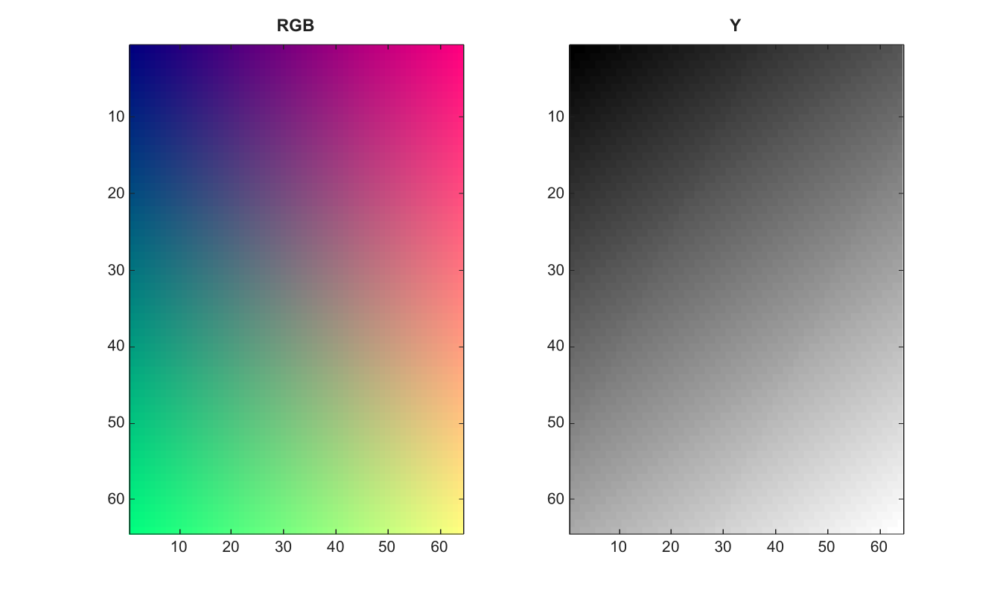

# rgb2ycbcr

Convert RGB color values to YCbCr color values.

## 📝 Syntax

- YCBCR = rgb2ycbcr(RGB)

## 📥 Input argument

- RGB - m-by-n-by-3 RGB image, or c-by-3 double colormap with values in the range [0, 1].

## 📤 Output argument

- YCBCR - YCbCr image or colormap. uint8, uint16, and single inputs preserve their class; other inputs return double.

## 📄 Description

Convert RGB color values to YCbCr color values. Inputs can be m-by-n-by-3 images or c-by-3 double colormaps with values in the range [0, 1].

## 💡 Example

Display luminance after RGB to YCbCr conversion

```matlab
RGB=zeros(64,64,3);
[X,Y]=meshgrid(linspace(0,1,64),linspace(0,1,64));
RGB(:,:,1)=X; RGB(:,:,2)=Y; RGB(:,:,3)=0.5;
YCBCR=rgb2ycbcr(RGB);
figure; subplot(1,2,1); image(RGB); title('RGB');
subplot(1,2,2); imagesc(YCBCR(:,:,1)); g=linspace(0,1,64)'; colormap([g g g]); title('Y');
```



## 🔗 See also

[ycbcr2rgb](../../../image_processing/ycbcr2rgb.md), [rgb2hsv](../../../image_processing/rgb2hsv.md).

## 🕔 History

| Version | 📄 Description  |
| ------- | --------------- |
| 2.0.0   | initial version |

<!--
## 👤 Author

Allan CORNET
-->
