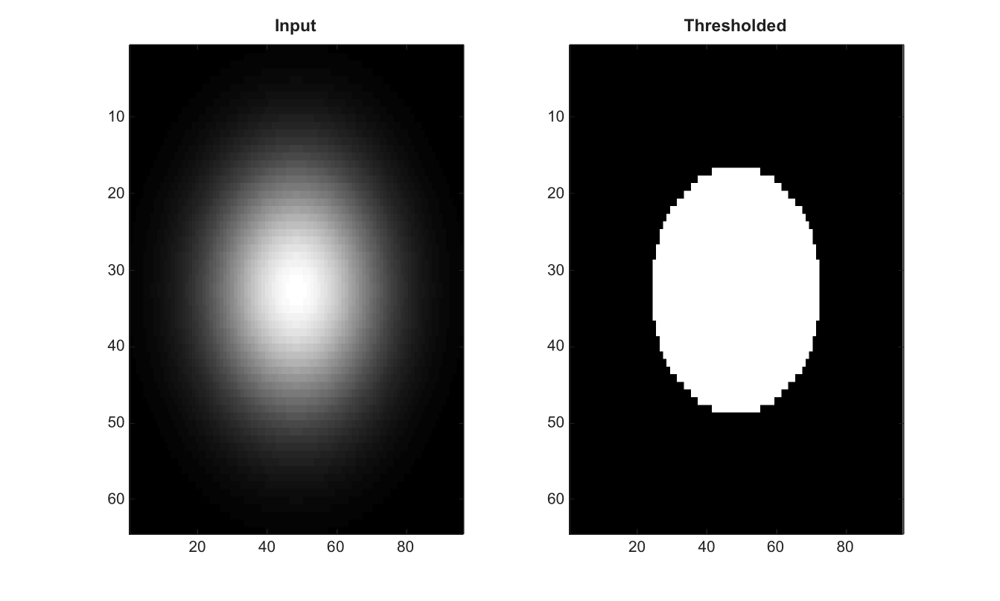

# graythresh

Compute a global threshold using Otsu method.

## 📝 Syntax

- level = graythresh(I)
- [level, effectiveness] = graythresh(I)

## 📥 Input argument

- I - Input image used to compute the histogram threshold.

## 📤 Output argument

- level - Normalized threshold in the range [0, 1].
- effectiveness - Separability effectiveness metric in the range [0, 1].

## 📄 Description

Compute a global threshold using Otsu method. The optional second output is an effectiveness metric in the range [0, 1].

## 💡 Example

Compute and apply a global threshold

```matlab
[X,Y]=meshgrid(linspace(-1,1,96),linspace(-1,1,64));
I=exp(-4*(X.^2+Y.^2));
[level,effectiveness]=graythresh(I);
BW=I>level;
figure; subplot(1,2,1); imagesc(I); g=linspace(0,1,64)'; colormap([g g g]); title('Input');
subplot(1,2,2); imagesc(BW); g=linspace(0,1,64)'; colormap([g g g]); title('Thresholded');
```



## 🔗 See also

[imbinarize](../../../image_processing/imbinarize.md), [adaptthresh](../../../image_processing/adaptthresh.md), [imhist](../../../image_processing/imhist.md).

## 🕔 History

| Version | 📄 Description  |
| ------- | --------------- |
| 2.0.0   | initial version |

<!--
## 👤 Author

Allan CORNET
-->
