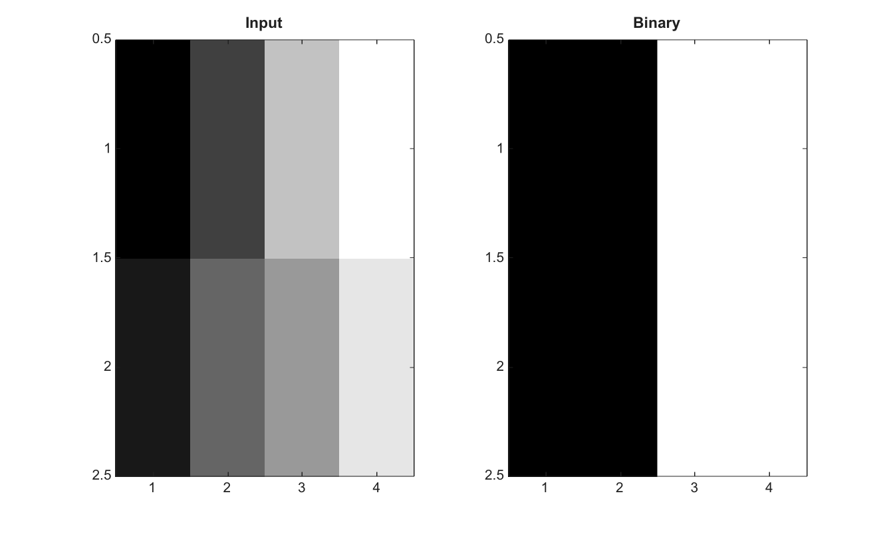

# imbinarize

Binarize image using a threshold.

## 📝 Syntax

- BW = imbinarize(I)
- BW = imbinarize(I, T)
- BW = imbinarize(I, 'global')
- BW = imbinarize(I, 'adaptive')
- BW = imbinarize(\_\_, 'Sensitivity', value)
- BW = imbinarize(\_\_, 'ForegroundPolarity', polarity)

## 📥 Input argument

- I - Input image.
- T - Numeric threshold. It can be scalar or the same size as I.
- method - Binarization method: 'global' or 'adaptive'.
- 'Sensitivity' - Sensitivity passed to adaptive thresholding.
- 'ForegroundPolarity' - Foreground polarity for adaptive thresholding: 'bright' or 'dark'.

## 📤 Output argument

- BW - Logical binary image.

## 📄 Description


Binarize image using a threshold. The global method uses graythresh when no threshold is supplied. A numeric threshold can be scalar or the same size as the input. The adaptive method uses adaptthresh and supports bright or dark foreground polarity.

## 💡 Examples

Binarize a grayscale image using a global threshold

```matlab
I=[0 0.25 0.75 1; 0.1 0.4 0.6 0.9];
BW=imbinarize(I,0.5);
figure; subplot(1,2,1); imagesc(I); g=linspace(0,1,64)'; colormap([g g g]); title('Input');
subplot(1,2,2); imagesc(BW); g=linspace(0,1,64)'; colormap([g g g]); title('Binary');
```

Binarize using an adaptive threshold

```matlab
I=[0.1 0.1 0.1; 0.1 0.9 0.1; 0.1 0.1 0.1];
BW=imbinarize(I,'adaptive','Sensitivity',0.4)
```


## 🔗 See also

[graythresh](../../../image_processing/1_image_basics/2_contrast_thresholding/graythresh.md), [adaptthresh](../../../image_processing/1_image_basics/2_contrast_thresholding/adaptthresh.md), [imcomplement](../../../image_processing/1_image_basics/2_contrast_thresholding/imcomplement.md).

## 🕔 History

| Version | 📄 Description     |
| ------- | --------------- |
| 2.0.0   | initial version |

<!--
## 👤 Author

Allan CORNET
-->
