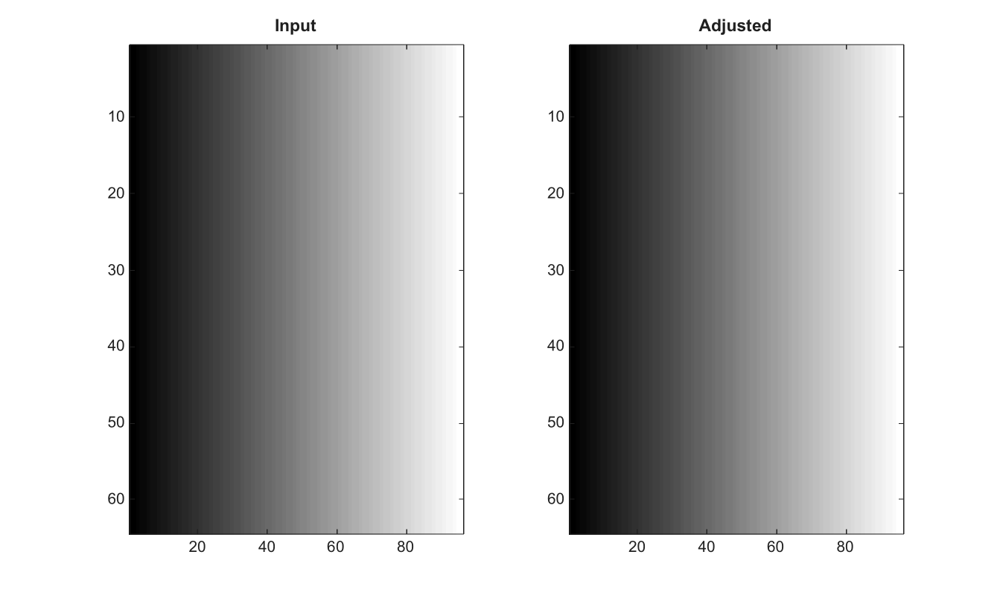

# stretchlim

Find contrast stretching limits.

## 📝 Syntax

- limits = stretchlim(I)
- limits = stretchlim(I, tol)

## 📥 Input argument

- I - Input grayscale or RGB image.
- tol - Scalar tolerance or two-element tolerance vector in the range [0, 1].

## 📤 Output argument

- limits - 2-by-N matrix of lower and upper contrast limits, with one column per channel.

## 📄 Description


Find contrast stretching limits.

## 💡 Example

Stretch image contrast with computed limits

```matlab
I=0.2+0.6*repmat(linspace(0,1,96),64,1);
limits=stretchlim(I);
J=imadjust(I,limits,[0;1]);
figure; subplot(1,2,1); imagesc(I); g=linspace(0,1,64)'; colormap([g g g]); title('Input');
subplot(1,2,2); imagesc(J); g=linspace(0,1,64)'; colormap([g g g]); title('Adjusted');
```



## 🔗 See also

[imadjust](../../../image_processing/1_image_basics/2_contrast_thresholding/imadjust.md), [imhist](../../../image_processing/1_image_basics/2_contrast_thresholding/imhist.md).

## 🕔 History

| Version | 📄 Description     |
| ------- | --------------- |
| 2.0.0   | initial version |

<!--
## 👤 Author

Allan CORNET
-->
