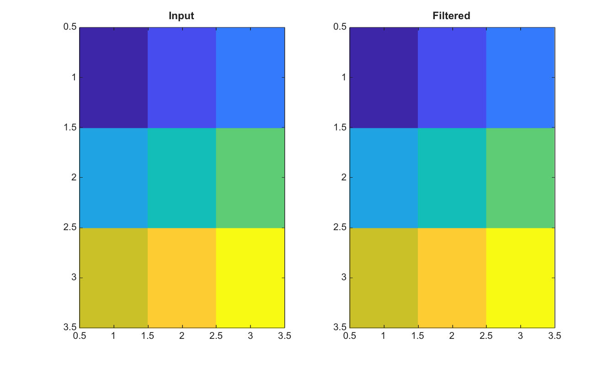

# imfilter

Filter an image with a 2-D kernel.

## 📝 Syntax

- B = imfilter(A, H)
- B = imfilter(A, H, option)

## 📥 Input argument

- A - 2-D numeric/logical image or RGB image to filter.
- H - Nonempty real 2-D numeric filter kernel.
- option - Shape, padding or operation option: same, full, valid, replicate, symmetric, circular, corr or conv. A finite scalar can be used as constant padding.

## 📤 Output argument

- B - Filtered image.

## 📄 Description

Filter an image with a 2-D kernel. By default, the filter is applied by correlation. Options include same, full, valid, replicate, symmetric, circular, corr and conv. Text options are case-insensitive.

## 💡 Example

Filter a grayscale image with an averaging filter

```matlab
I=double([1 2 3; 4 5 6; 7 8 9]);
H=fspecial('average',[3 3]);
J=imfilter(I,H,'replicate');
figure; subplot(1,2,1); imagesc(I); title('Input');
subplot(1,2,2); imagesc(J); title('Filtered');
```



## 🔗 See also

[fspecial](../../../image_processing/fspecial.md), [imgaussfilt](../../../image_processing/imgaussfilt.md), [padarray](../../../image_processing/padarray.md).

## 🕔 History

| Version | 📄 Description  |
| ------- | --------------- |
| 2.0.0   | initial version |

<!--
## 👤 Author

Allan CORNET
-->
