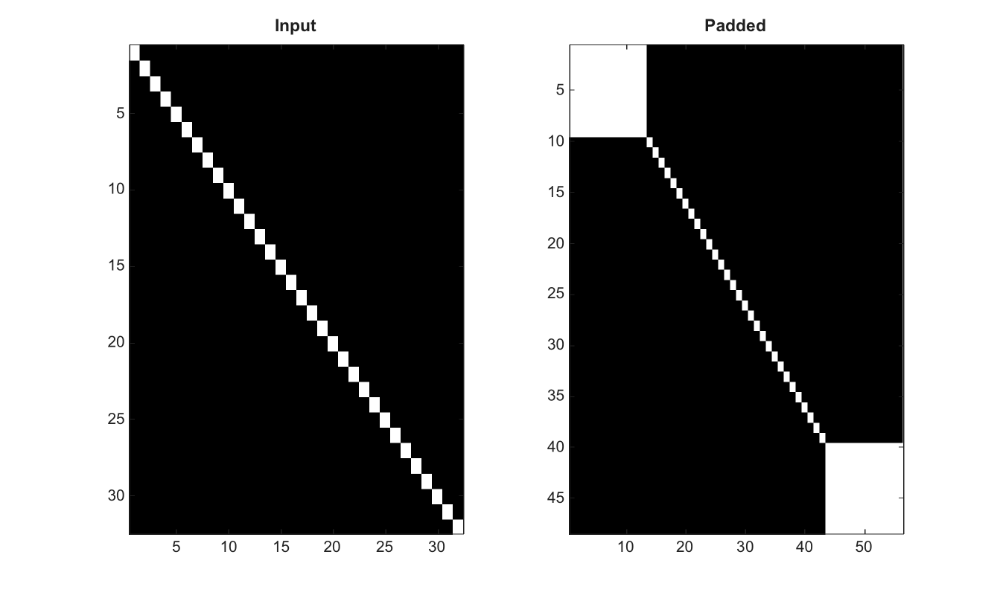

# padarray

Pad an array before image filtering or morphology.

## 📝 Syntax

- B = padarray(A, padSize)
- B = padarray(A, padSize, method)
- B = padarray(A, padSize, method, direction)

## 📥 Input argument

- A - 2-D numeric/logical image or RGB image to pad.
- padSize - Nonnegative integer scalar or two-element vector that specifies row and column padding.
- method - Padding method: numeric/logical constant, replicate, symmetric or circular.
- direction - Padding direction: pre, post or both. The default value is both.

## 📤 Output argument

- B - Padded image or array, preserving the input class.

## 📄 Description


Pad an array before image filtering or morphology. Supported padding methods include numeric constants, replicate, symmetric and circular. Direction can be pre, post or both. Text options are case-insensitive.

## 💡 Example

Pad an image

```matlab
I=eye(32);
P=padarray(I,[8 12],'replicate');
figure; subplot(1,2,1); imagesc(I); g=linspace(0,1,64)'; colormap([g g g]); title('Input');
subplot(1,2,2); imagesc(P); g=linspace(0,1,64)'; colormap([g g g]); title('Padded');
```



## 🔗 See also

[imfilter](../../../image_processing/1_image_basics/3_filtering_edges/imfilter.md), [medfilt2](../../../image_processing/1_image_basics/3_filtering_edges/medfilt2.md).

## 🕔 History

| Version | 📄 Description     |
| ------- | --------------- |
| 2.0.0   | initial version |

<!--
## 👤 Author

Allan CORNET
-->
