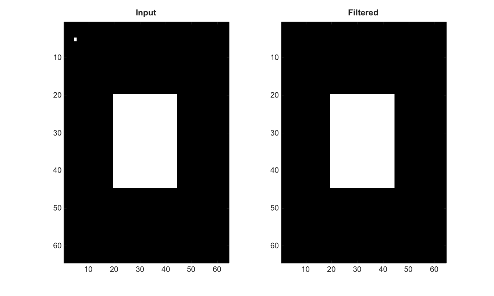

# bwareaopen

Remove small connected components from a binary image.

## 📝 Syntax

- BW2 = bwareaopen(BW, minSize)
- BW2 = bwareaopen(BW, minSize, conn)

## 📥 Input argument

- BW - Input binary image. Nonzero values are treated as true.
- minSize - Minimum connected-component size to keep, as a nonnegative integer scalar.
- conn - Connectivity, either 4 or 8.

## 📤 Output argument

- BW2 - Logical image after small components are removed.

## 📄 Description


Remove small connected components from a binary image. minSize must be a nonnegative integer scalar. Supported connectivities are 4 and 8.

## 💡 Example

Remove small objects

```matlab
BW=false(64,64); BW(20:44,20:44)=true; BW(5,5)=true;
J=bwareaopen(BW,10);
figure; subplot(1,2,1); imagesc(BW); g=linspace(0,1,64)'; colormap([g g g]); title('Input');
subplot(1,2,2); imagesc(J); g=linspace(0,1,64)'; colormap([g g g]); title('Filtered');
```



## 🔗 See also

[bwmorph](../../../image_processing/2_image_analysis/4_morphology/bwmorph.md), [imopen](../../../image_processing/2_image_analysis/4_morphology/imopen.md).

## 🕔 History

| Version | 📄 Description     |
| ------- | --------------- |
| 2.0.0   | initial version |

<!--
## 👤 Author

Allan CORNET
-->
