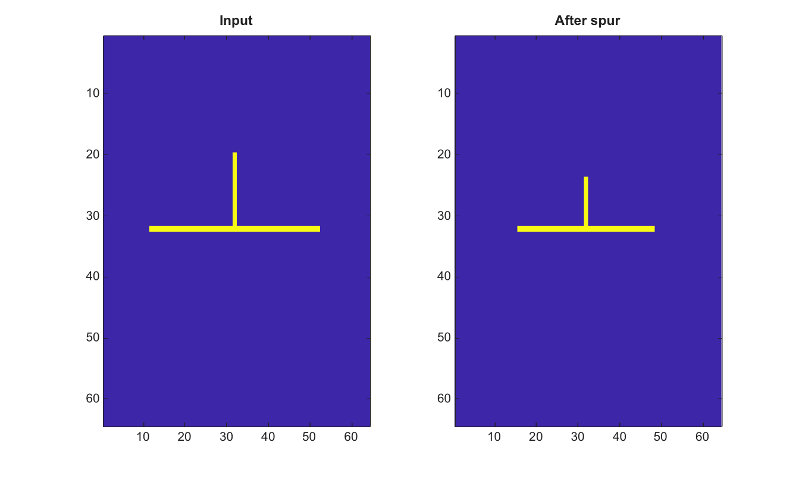

# bwmorph

Apply morphological operations to binary images.

## 📝 Syntax

- BW2 = bwmorph(BW, operation)
- BW2 = bwmorph(BW, operation, n)

## 📥 Input argument

- BW - 2-D numeric or logical binary image. Nonzero values are treated as true.
- operation - Operation name: 'clean', 'fill', 'majority', 'remove', 'endpoints', 'branchpoints', 'spur', 'bridge', 'thin', 'skel', 'dilate', 'erode', 'open', 'close', 'tophat', or 'bothat'.
- n - Number of iterations. It must be a nonnegative integer scalar or Inf. The default value is 1.

## 📤 Output argument

- BW2 - Logical image after applying the requested operation.

## 📄 Description

Apply binary morphological operations to a 2-D image.

Dilate, erode, open, close, tophat, and bothat use a 3-by-3 square neighborhood.

The iteration count n can be a nonnegative integer or Inf.

## 💡 Example

Remove endpoints from a binary line

```matlab
BW=false(64,64); BW(32,12:52)=true; BW(20:32,32)=true;
BW2=bwmorph(BW,'spur',4);
figure; subplot(1,2,1); imagesc(BW); title('Input');
subplot(1,2,2); imagesc(BW2); title('After spur');
```



## 🔗 See also

[imdilate](../../../image_processing/imdilate.md), [imerode](../../../image_processing/imerode.md), [bwperim](../../../image_processing/bwperim.md).

## 🕔 History

| Version | 📄 Description  |
| ------- | --------------- |
| 2.0.0   | initial version |

<!--
## 👤 Author

Allan CORNET
-->
