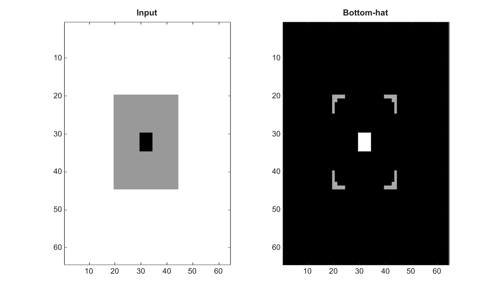

# imbothat

Bottom-hat filtering of an image.

## 📝 Syntax

- J = imbothat(I, SE)

## 📥 Input argument

- I - Input grayscale image.
- SE - Structuring element structure or logical neighborhood.

## 📤 Output argument

- J - Bottom-hat filtered image.

## 📄 Description

Bottom-hat filtering of an image.

## 💡 Example

Apply bottom-hat filtering

```matlab
I=ones(64,64); I(20:44,20:44)=0.6; I(30:34,30:34)=0;
J=imbothat(I,strel('disk',5));
figure; subplot(1,2,1); imagesc(I); g=linspace(0,1,64)'; colormap([g g g]); title('Input');
subplot(1,2,2); imagesc(J); g=linspace(0,1,64)'; colormap([g g g]); title('Bottom-hat');
```



## 🔗 See also

[imtophat](../../../image_processing/imtophat.md), [imclose](../../../image_processing/imclose.md), [strel](../../../image_processing/strel.md).

## 🕔 History

| Version | 📄 Description  |
| ------- | --------------- |
| 2.0.0   | initial version |

<!--
## 👤 Author

Allan CORNET
-->
