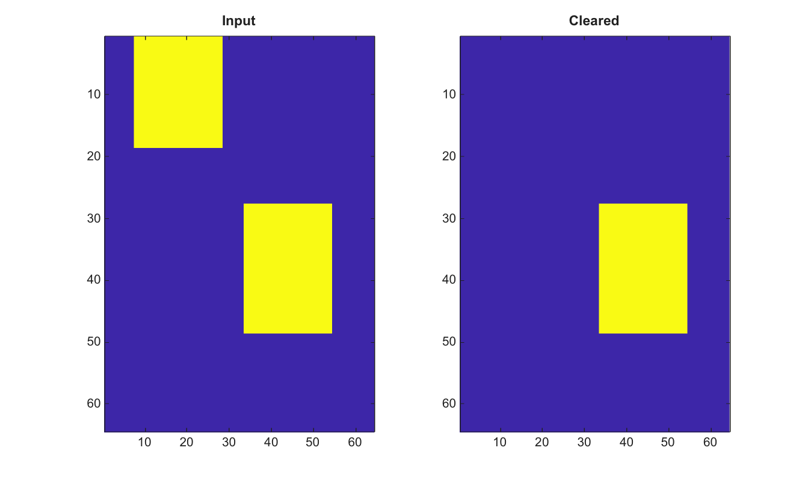

# imclearborder

Remove binary image components connected to the image border.

## 📝 Syntax

- BW2 = imclearborder(BW)
- BW2 = imclearborder(BW, conn)

## 📥 Input argument

- BW - Input 2-D binary image.
- conn - Connectivity, either 4, 8, or an equivalent 3-by-3 matrix.

## 📤 Output argument

- BW2 - Logical image after border-connected components are removed.

## 📄 Description

imclearborder removes foreground components that touch the first or last row or column. It is useful after thresholding or segmentation when partial border objects should be discarded.

## 💡 Example

Remove border components

```matlab
BW=false(64,64);
BW(1:18,8:28)=true; BW(28:48,34:54)=true;
BW2=imclearborder(BW);
figure; subplot(1,2,1); imagesc(BW); title('Input');
subplot(1,2,2); imagesc(BW2); title('Cleared');
```



## 🔗 See also

[bwconncomp](../../../image_processing/bwconncomp.md), [bwareaopen](../../../image_processing/bwareaopen.md), [imfill](../../../image_processing/imfill.md).

## 🕔 History

| Version | 📄 Description  |
| ------- | --------------- |
| 2.0.0   | initial version |

<!--
## 👤 Author

Allan CORNET
-->
