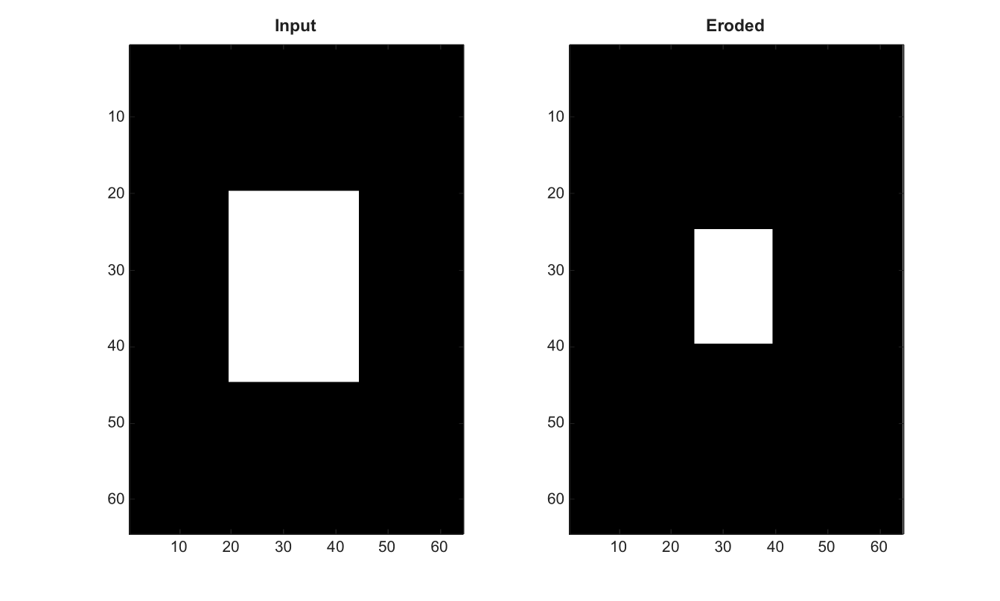

# imerode

Erode a binary or grayscale image or volume.

## 📝 Syntax

- J = imerode(I, SE)

## 📥 Input argument

- I - Input binary or grayscale image, or 3-D volume.
- SE - Structuring element structure or logical neighborhood.

## 📤 Output argument

- J - Eroded image or volume.

## 📄 Description

Erode a binary or grayscale image. With a 3-D structuring element, imerode erodes a 3-D volume.

## 💡 Example

Erode a binary image

```matlab
BW=false(64,64); BW(20:44,20:44)=true;
J=imerode(BW,strel('disk',5));
figure; subplot(1,2,1); imagesc(BW); g=linspace(0,1,64)'; colormap([g g g]); title('Input');
subplot(1,2,2); imagesc(J); g=linspace(0,1,64)'; colormap([g g g]); title('Eroded');
```



## 🔗 See also

[imdilate](../../../image_processing/imdilate.md), [imopen](../../../image_processing/imopen.md), [imclose](../../../image_processing/imclose.md), [strel](../../../image_processing/strel.md).

## 🕔 History

| Version | 📄 Description  |
| ------- | --------------- |
| 2.0.0   | initial version |

<!--
## 👤 Author

Allan CORNET
-->
