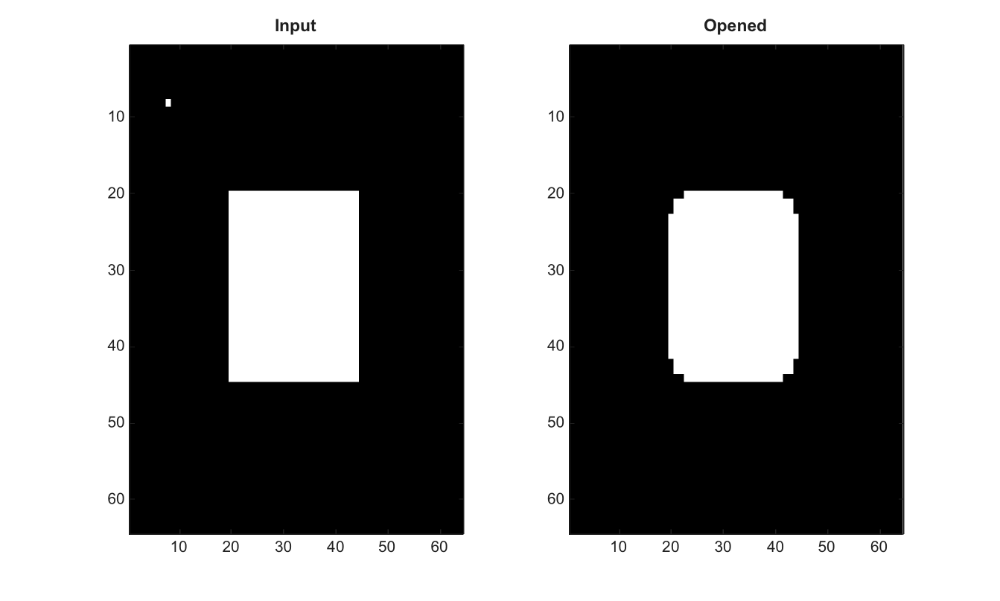

# imopen

Open an image by erosion followed by dilation.

## 📝 Syntax

- J = imopen(I, SE)

## 📥 Input argument

- I - Input binary or grayscale image.
- SE - Structuring element structure or logical neighborhood.

## 📤 Output argument

- J - Opened image.

## 📄 Description


Open an image by erosion followed by dilation.

## 💡 Example

Open a binary image

```matlab
BW=false(64,64); BW(20:44,20:44)=true; BW(8,8)=true;
J=imopen(BW,strel('disk',3));
figure; subplot(1,2,1); imagesc(BW); g=linspace(0,1,64)'; colormap([g g g]); title('Input');
subplot(1,2,2); imagesc(J); g=linspace(0,1,64)'; colormap([g g g]); title('Opened');
```



## 🔗 See also

[imclose](../../../image_processing/2_image_analysis/4_morphology/imclose.md), [imerode](../../../image_processing/2_image_analysis/4_morphology/imerode.md), [imdilate](../../../image_processing/2_image_analysis/4_morphology/imdilate.md).

## 🕔 History

| Version | 📄 Description     |
| ------- | --------------- |
| 2.0.0   | initial version |

<!--
## 👤 Author

Allan CORNET
-->
