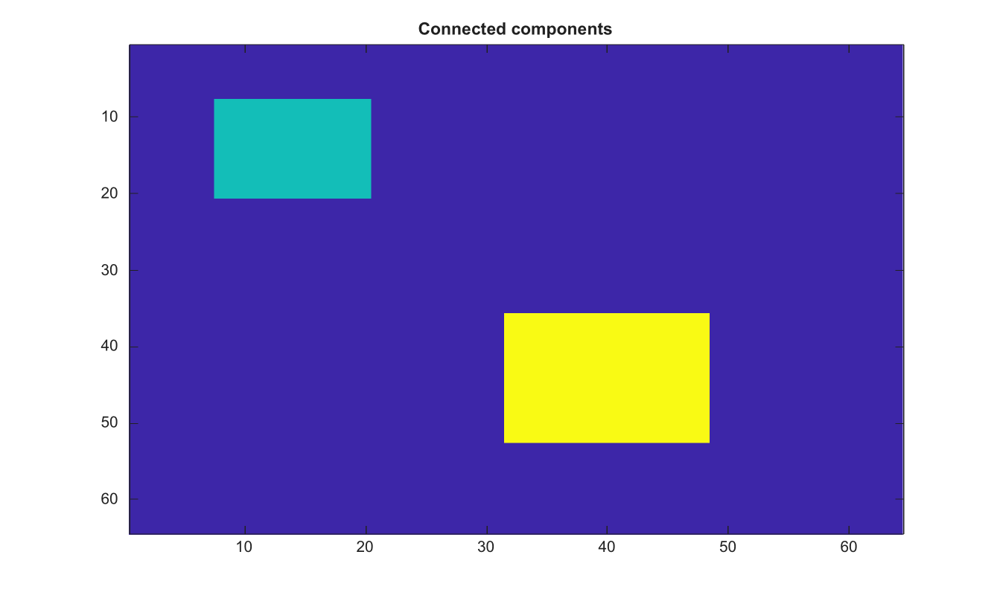

# bwconncomp

Find connected components in a binary image or volume.

## 📝 Syntax

- CC = bwconncomp(BW)
- CC = bwconncomp(BW, conn)

## 📥 Input argument

- BW - Binary image or volume. Numeric input is treated as foreground where values are nonzero.
- conn - Connectivity. Use 4 or 8 for 2-D images, and 6, 18, or 26 for 3-D volumes. The default is maximal connectivity.

## 📤 Output argument

- CC - Connected-component structure with Connectivity, ImageSize, NumObjects, and PixelIdxList fields.

## 📄 Description


Find connected foreground components in a 2-D binary image or 3-D binary volume. 

The returned structure contains Connectivity, ImageSize, NumObjects, and PixelIdxList fields.

## 💡 Example

Find and display connected components

```matlab
BW=false(64,64); BW(8:20,8:20)=true; BW(36:52,32:48)=true;
CC=bwconncomp(BW);
L=labelmatrix(CC);
figure; imagesc(L); title('Connected components');
```



## 🔗 See also

[labelmatrix](../../../image_processing/2_image_analysis/5_regions_boundaries/labelmatrix.md), [bwlabel](../../../image_processing/2_image_analysis/5_regions_boundaries/bwlabel.md).

## 🕔 History

| Version | 📄 Description     |
| ------- | --------------- |
| 2.0.0   | initial version |

<!--
## 👤 Author

Allan CORNET
-->
