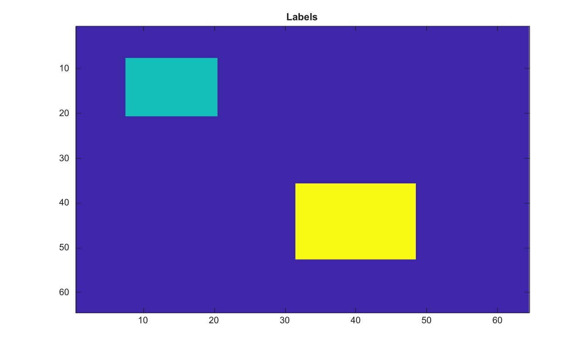

# bwlabel

Label connected components in a binary image.

## 📝 Syntax

- L = bwlabel(BW)
- L = bwlabel(BW, conn)
- [L, num] = bwlabel(...)

## 📥 Input argument

- BW - Input binary image. Nonzero values are treated as true.
- conn - Connectivity passed to bwconncomp.

## 📤 Output argument

- L - Label matrix with one positive label per connected component.
- num - Number of connected components.

## 📄 Description


Label connected components in a binary image.

## 💡 Example

Label connected components

```matlab
BW=false(64,64); BW(8:20,8:20)=true; BW(36:52,32:48)=true;
L=bwlabel(BW);
figure; imagesc(L); title('Labels');
```



## 🔗 See also

[bwconncomp](../../../image_processing/2_image_analysis/5_regions_boundaries/bwconncomp.md), [labelmatrix](../../../image_processing/2_image_analysis/5_regions_boundaries/labelmatrix.md), [regionprops](../../../image_processing/2_image_analysis/5_regions_boundaries/regionprops.md).

## 🕔 History

| Version | 📄 Description     |
| ------- | --------------- |
| 2.0.0   | initial version |

<!--
## 👤 Author

Allan CORNET
-->
