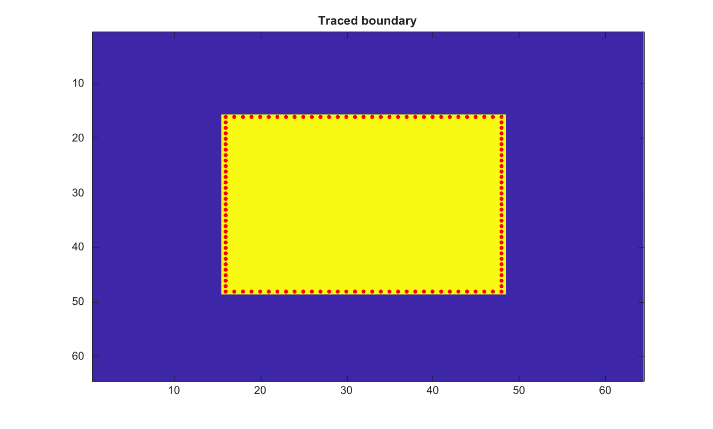

# bwtraceboundary

Trace boundary pixels of a binary object.

## 📝 Syntax

- B = bwtraceboundary(BW, p)
- B = bwtraceboundary(BW, p, fstep, conn)
- B = bwtraceboundary(BW, p, fstep, conn, m)

## 📥 Input argument

- BW - Input binary image. Nonzero values are treated as true.
- p - Boundary start point [row column].
- fstep - First search direction.
- conn - Connectivity, either 4 or 8.
- m - Maximum number of boundary points to return.

## 📤 Output argument

- B - Boundary coordinates as an N-by-2 [row column] matrix.

## 📄 Description


Trace boundary pixels of the binary object containing the start point p = [row column]. Supported connectivities are 4 and 8. The first search direction can be N, NE, E, SE, S, SW, W, or NW for 8-connectivity, and N, E, S, or W for 4-connectivity.

## 💡 Example

Trace a square boundary

```matlab
BW=false(64,64); BW(16:48,16:48)=true;
B=bwtraceboundary(BW, [16 16], 'E', 8);
figure; imagesc(BW); hold on; plot(B(:,2), B(:,1), 'r.'); title('Traced boundary');
```



## 🔗 See also

[bwboundaries](../../../image_processing/2_image_analysis/5_regions_boundaries/bwboundaries.md), [bwperim](../../../image_processing/2_image_analysis/4_morphology/bwperim.md).

## 🕔 History

| Version | 📄 Description     |
| ------- | --------------- |
| 2.0.0   | initial version |

<!--
## 👤 Author

Allan CORNET
-->
