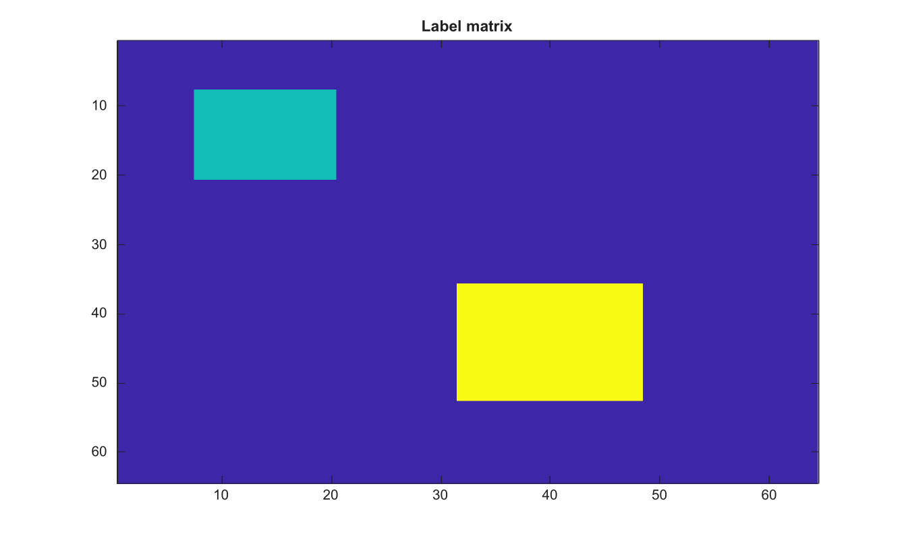

# labelmatrix

Create label matrix from connected components.

## 📝 Syntax

- L = labelmatrix(CC)

## 📥 Input argument

- CC - Connected-component structure returned by bwconncomp.

## 📤 Output argument

- L - Label matrix with one positive label per component.

## 📄 Description

Create label matrix from connected components.

## 💡 Example

Display connected component labels

```matlab
BW=false(64,64); BW(8:20,8:20)=true; BW(36:52,32:48)=true;
CC=bwconncomp(BW);
L=labelmatrix(CC);
figure; imagesc(L); title('Label matrix');
```



## 🔗 See also

[bwconncomp](../../../image_processing/bwconncomp.md), [bwlabel](../../../image_processing/bwlabel.md), [regionprops](../../../image_processing/regionprops.md).

## 🕔 History

| Version | 📄 Description  |
| ------- | --------------- |
| 2.0.0   | initial version |

<!--
## 👤 Author

Allan CORNET
-->
