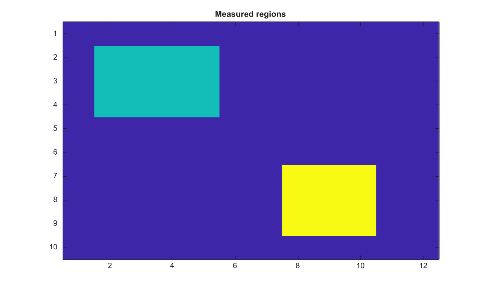

# regionprops

Measure properties of image regions.

## 📝 Syntax

- stats = regionprops(BW)
- stats = regionprops(CC, properties)
- stats = regionprops(L, properties)
- stats = regionprops(regions, I, properties)

## 📥 Input argument

- BW - Binary image whose connected components define regions.
- CC - Connected-component structure returned by bwconncomp.
- L - Nonnegative integer label matrix.
- I - Optional same-size grayscale intensity image for intensity measurements.
- properties - Property name, cell array of property names, or 'all'/'basic'.

## 📤 Output argument

- stats - Structure array containing one element per measured region.

## 📄 Description

Measure properties of image regions. Binary images use connected components, numeric 2-D nonnegative integer label matrices use one region per positive label, and connected-component structures can be passed directly. Supported properties include Area, Centroid, BoundingBox, PixelIdxList, PixelList, Image, SubarrayIdx, Extent, EquivDiameter, Perimeter, Orientation, MajorAxisLength, MinorAxisLength, Eccentricity, ConvexHull, ConvexImage, ConvexArea, Solidity, and intensity measurements when a same-size grayscale intensity image is provided.

## 💡 Examples

Calculate centroids and region measurements

```matlab
BW=false(10,12); BW(2:4,2:5)=true; BW(7:9,8:10)=true;
S=regionprops(BW,'Area','BoundingBox','Centroid');
L=bwlabel(BW);
figure; imagesc(L); title('Measured regions');
```


Measure intensity values in regions

```matlab
BW = logical([1 0 0 1; 1 0 0 0; 0 0 1 1]);
I = [10 0 0 2; 20 0 0 0; 0 0 30 40];
S = regionprops(BW, I, 'Area', 'PixelValues', 'WeightedCentroid', 'Extent')
```

## 🔗 See also

[bwlabel](../../../image_processing/bwlabel.md), [bwconncomp](../../../image_processing/bwconncomp.md), [labelmatrix](../../../image_processing/labelmatrix.md).

## 🕔 History

| Version | 📄 Description  |
| ------- | --------------- |
| 2.0.0   | initial version |

<!--
## 👤 Author

Allan CORNET
-->
