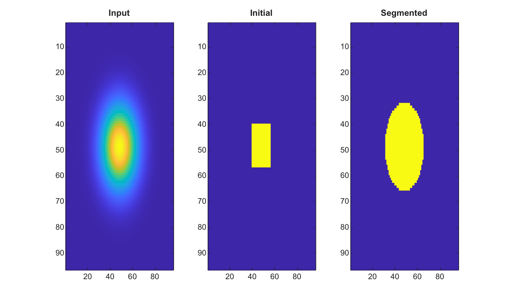

# activecontour

Segment an image from an initial contour mask.

## 📝 Syntax

- BW = activecontour(I, mask)
- BW = activecontour(I, mask, iterations)
- BW = activecontour(I, mask, iterations, method)
- BW = activecontour(\_\_\_, Name, Value)

## 📥 Input argument

- I - Finite real 2-D grayscale, RGB, or RGBA image. Color images are converted to luminance before segmentation.
- mask - Initial 2-D contour mask. Numeric masks are converted to logical values.
- iterations - Nonnegative integer number of evolution iterations. The default value is 100.
- method - Segmentation method: 'chan-vese' or 'edge'.
- Name, Value - Supported options are 'Iterations', 'Method', 'SmoothFactor', and 'ContractionBias'.

## 📤 Output argument

- BW - Logical mask of the segmented region.

## 📄 Description

Segment a finite real 2-D image by evolving a binary initial mask. RGB and RGBA images are converted to luminance, and the alpha channel is ignored. The default method is chan-vese. The edge method uses the same region model with edge-weighted smoothing.

The supported name-value options are <b>Iterations</b>, <b>Method</b>, <b>SmoothFactor</b>, a nonnegative finite scalar, and <b>ContractionBias</b>, a finite scalar in the range [-1, 1]. The default values are 100, chan-vese, 1 and 0.

## 💡 Examples

Segment a bright disk from a small initial mask

```matlab
[X,Y]=meshgrid(linspace(-1,1,96),linspace(-1,1,96));
I=exp(-9*(X.^2+Y.^2));
mask=false(size(I));
mask(40:56,40:56)=true;
BW=activecontour(I,mask,40);
figure; subplot(1,3,1); imagesc(I); title('Input');
subplot(1,3,2); imagesc(mask); title('Initial');
subplot(1,3,3); imagesc(BW); title('Segmented');
```


Use edge mode with explicit smoothing

```matlab
I=zeros(7,7);
I(3:5,3:5)=1;
mask=false(7,7);
mask(4,4)=true;
BW=activecontour(I,mask,'Iterations',8,'Method','edge','SmoothFactor',1,'ContractionBias',0);
```

## 🔗 See also

[watershed](../../../image_processing/watershed.md), [imreconstruct](../../../image_processing/imreconstruct.md), [graythresh](../../../image_processing/graythresh.md).

## 🕔 History

| Version | 📄 Description  |
| ------- | --------------- |
| 2.0.0   | initial version |

<!--
## 👤 Author

Allan CORNET
-->
