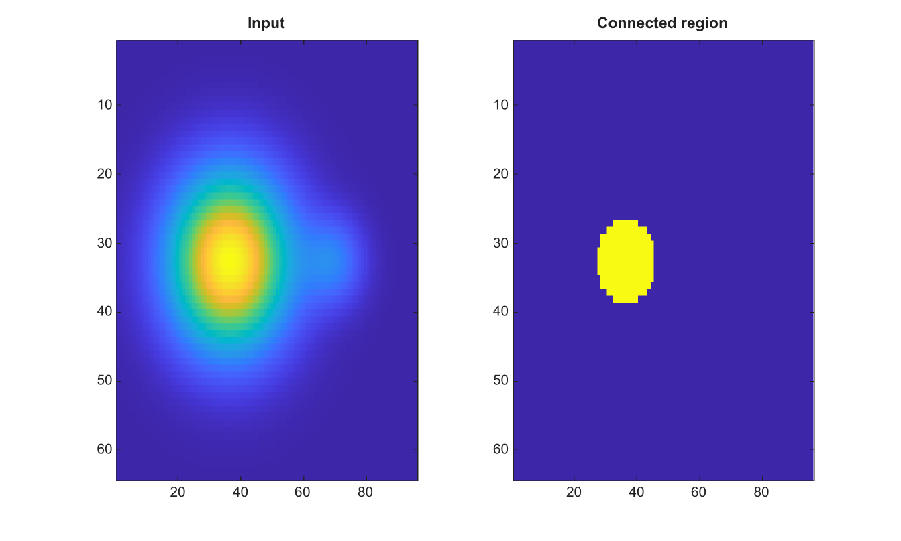

# grayconnected

Select a connected grayscale region from a seed pixel.

## 📝 Syntax

- BW = grayconnected(I, row, col)
- BW = grayconnected(I, row, col, tolerance)
- BW = grayconnected(I, row, col, tolerance, conn)

## 📥 Input argument

- I - Finite real 2-D numeric or logical image.
- row - Seed row subscript.
- col - Seed column subscript.
- tolerance - Nonnegative tolerance in normalized intensity units. The default value is 0.32.
- conn - Connectivity, either 4, 8, or an equivalent 3-by-3 matrix. The default value is 8.

## 📤 Output argument

- BW - Logical mask containing the connected pixels within tolerance of the seed intensity.

## 📄 Description

grayconnected grows a connected region from a seed pixel. Pixels are included when their normalized intensity differs from the seed intensity by no more than the tolerance and they are connected to the seed through included pixels.

Integer and logical inputs are converted to normalized double precision values for the tolerance comparison. The output is always logical.

## 💡 Example

Grow a grayscale region from a seed pixel

```matlab
[X,Y]=meshgrid(linspace(-1,1,96),linspace(-1,1,64));
I=0.2+0.6*exp(-6*((X+0.25).^2+Y.^2))+0.15*exp(-24*((X-0.45).^2+Y.^2));
BW=grayconnected(I,32,38,0.12,8);
figure; subplot(1,2,1); imagesc(I); title('Input');
subplot(1,2,2); imagesc(BW); title('Connected region');
```



## 🔗 See also

[bwselect](../../../image_processing/bwselect.md), [imregionalmin](../../../image_processing/imregionalmin.md), [watershed](../../../image_processing/watershed.md).

## 🕔 History

| Version | 📄 Description  |
| ------- | --------------- |
| 2.0.0   | initial version |

<!--
## 👤 Author

Allan CORNET
-->
