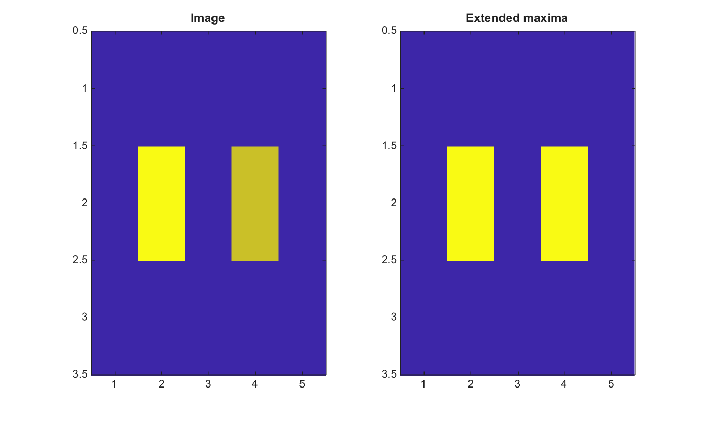

# imextendedmax

Find extended maxima in a 2-D image.

## 📝 Syntax

- BW = imextendedmax(I, h)
- BW = imextendedmax(I, h, conn)

## 📥 Input argument

- I - Input finite real 2-D image.
- h - Nonnegative finite height for the h-maxima transform.
- conn - Connectivity, either 4, 8, or an equivalent 3-by-3 matrix.

## 📤 Output argument

- BW - Logical mask of regional maxima after h-maxima suppression.

## 📄 Description

imextendedmax applies imhmax and then finds regional maxima. It helps build marker masks that ignore maxima shallower than h.

## 💡 Example

Find extended maxima

```matlab
I=[1 1 1 1 1;1 5 1 4 1;1 1 1 1 1];
BW=imextendedmax(I,2);
figure; subplot(1,2,1); imagesc(I); title('Image');
subplot(1,2,2); imagesc(BW); title('Extended maxima');
```



## 🔗 See also

[imhmax](../../../image_processing/imhmax.md), [imregionalmax](../../../image_processing/imregionalmax.md), [imextendedmin](../../../image_processing/imextendedmin.md).

## 🕔 History

| Version | 📄 Description  |
| ------- | --------------- |
| 2.0.0   | initial version |

<!--
## 👤 Author

Allan CORNET
-->
