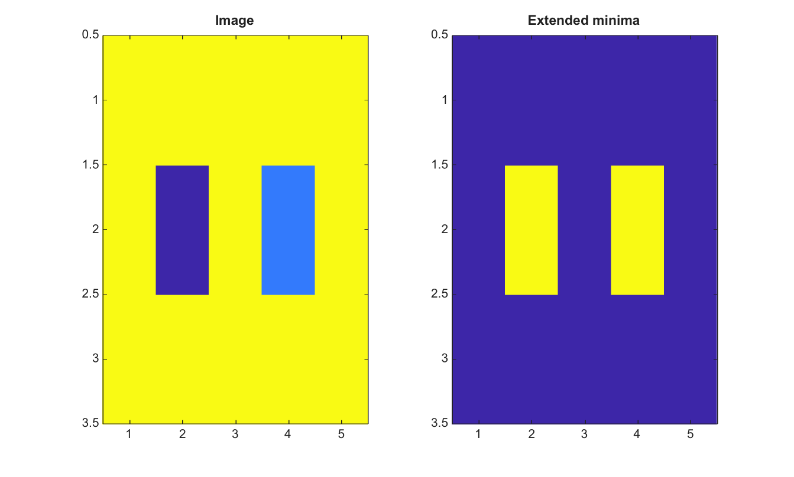

# imextendedmin

Find extended minima in a 2-D image.

## 📝 Syntax

- BW = imextendedmin(I, h)
- BW = imextendedmin(I, h, conn)

## 📥 Input argument

- I - Input finite real 2-D image.
- h - Nonnegative finite height for the h-minima transform.
- conn - Connectivity, either 4, 8, or an equivalent 3-by-3 matrix.

## 📤 Output argument

- BW - Logical mask of regional minima after h-minima suppression.

## 📄 Description

imextendedmin applies imhmin and then finds regional minima. It helps build marker masks that ignore minima shallower than h.

## 💡 Example

Find extended minima

```matlab
I=[5 5 5 5 5;5 1 5 2 5;5 5 5 5 5];
BW=imextendedmin(I,2);
figure; subplot(1,2,1); imagesc(I); title('Image');
subplot(1,2,2); imagesc(BW); title('Extended minima');
```



## 🔗 See also

[imhmin](../../../image_processing/imhmin.md), [imregionalmin](../../../image_processing/imregionalmin.md), [imimposemin](../../../image_processing/imimposemin.md), [watershed](../../../image_processing/watershed.md).

## 🕔 History

| Version | 📄 Description  |
| ------- | --------------- |
| 2.0.0   | initial version |

<!--
## 👤 Author

Allan CORNET
-->
