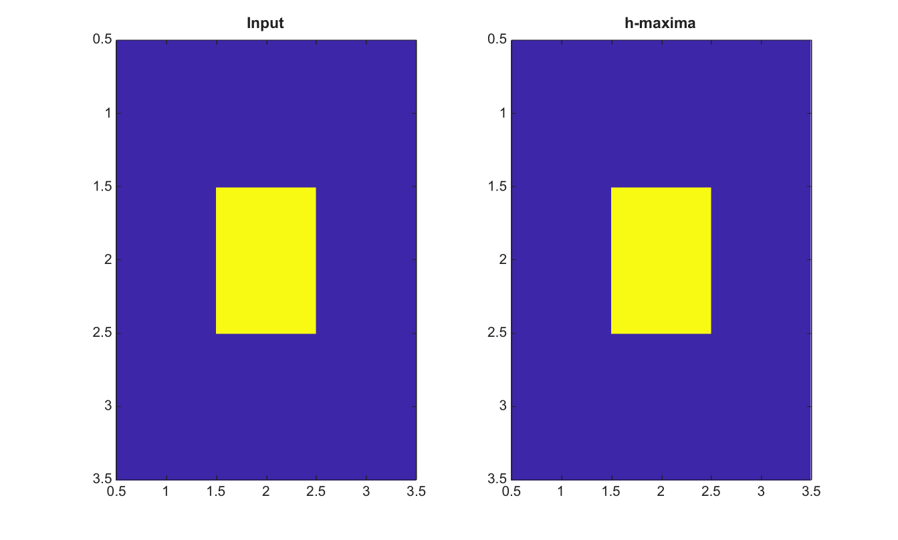

# imhmax

Suppress shallow maxima using the h-maxima transform.

## 📝 Syntax

- J = imhmax(I, h)
- J = imhmax(I, h, conn)

## 📥 Input argument

- I - Input finite real 2-D image.
- h - Nonnegative finite height used to suppress shallow maxima.
- conn - Connectivity, either 4, 8, or an equivalent 3-by-3 matrix.

## 📤 Output argument

- J - Image after h-maxima suppression.

## 📄 Description


imhmax suppresses maxima shallower than h. It is useful for foreground marker extraction before segmentation.

## 💡 Example

Suppress a shallow maximum

```matlab
I=[1 1 1;1 5 1;1 1 1];
J=imhmax(I,2);
figure; subplot(1,2,1); imagesc(I); title('Input');
subplot(1,2,2); imagesc(J); title('h-maxima');
```



## 🔗 See also

[imextendedmax](../../../image_processing/2_image_analysis/7_segmentation/imextendedmax.md), [imregionalmax](../../../image_processing/2_image_analysis/7_segmentation/imregionalmax.md), [imhmin](../../../image_processing/2_image_analysis/7_segmentation/imhmin.md).

## 🕔 History

| Version | 📄 Description     |
| ------- | --------------- |
| 2.0.0   | initial version |

<!--
## 👤 Author

Allan CORNET
-->
