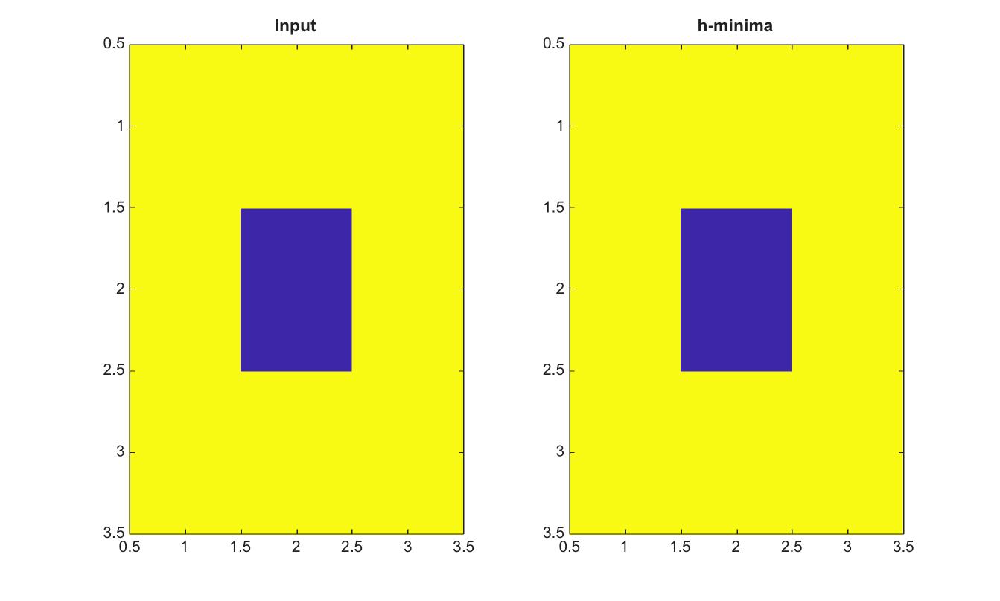

# imhmin

Suppress shallow minima using the h-minima transform.

## 📝 Syntax

- J = imhmin(I, h)
- J = imhmin(I, h, conn)

## 📥 Input argument

- I - Input finite real 2-D image.
- h - Nonnegative finite height used to suppress shallow minima.
- conn - Connectivity, either 4, 8, or an equivalent 3-by-3 matrix.

## 📤 Output argument

- J - Image after h-minima suppression.

## 📄 Description


imhmin computes the h-minima transform by grayscale reconstruction by erosion of I+h under I. It is useful for suppressing shallow minima before marker extraction or watershed segmentation.

## 💡 Example

Suppress a shallow minimum

```matlab
I=[5 5 5;5 2 5;5 5 5];
J=imhmin(I,2);
figure; subplot(1,2,1); imagesc(I); title('Input');
subplot(1,2,2); imagesc(J); title('h-minima');
```



## 🔗 See also

[imextendedmin](../../../image_processing/2_image_analysis/7_segmentation/imextendedmin.md), [imregionalmin](../../../image_processing/2_image_analysis/7_segmentation/imregionalmin.md), [watershed](../../../image_processing/2_image_analysis/7_segmentation/watershed.md).

## 🕔 History

| Version | 📄 Description     |
| ------- | --------------- |
| 2.0.0   | initial version |

<!--
## 👤 Author

Allan CORNET
-->
