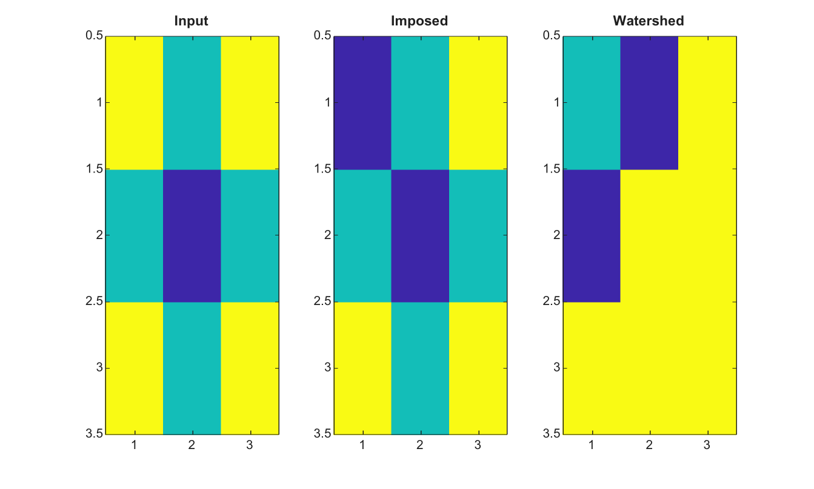

# imimposemin

Impose regional minima at marker pixels.

## 📝 Syntax

- J = imimposemin(I, BW)
- J = imimposemin(I, BW, conn)

## 📥 Input argument

- I - Input finite real 2-D image.
- BW - Binary marker mask with the same size as I.
- conn - Connectivity, either 4, 8, or an equivalent 3-by-3 matrix.

## 📤 Output argument

- J - Image whose marker pixels are forced to be minima.

## 📄 Description


imimposemin modifies an image so that marker pixels become the lowest minima. This is useful before watershed segmentation when known markers should seed catchment basins.

## 💡 Example

Use markers before watershed

```matlab
I=[5 4 5;4 3 4;5 4 5];
markers=false(3,3); markers(1,1)=true;
J=imimposemin(I,markers);
L=watershed(J,4);
figure; subplot(1,3,1); imagesc(I); title('Input');
subplot(1,3,2); imagesc(J); title('Imposed');
subplot(1,3,3); imagesc(L); title('Watershed');
```



## 🔗 See also

[imhmin](../../../image_processing/2_image_analysis/7_segmentation/imhmin.md), [imextendedmin](../../../image_processing/2_image_analysis/7_segmentation/imextendedmin.md), [imregionalmin](../../../image_processing/2_image_analysis/7_segmentation/imregionalmin.md), [watershed](../../../image_processing/2_image_analysis/7_segmentation/watershed.md), [activecontour](../../../image_processing/2_image_analysis/7_segmentation/activecontour.md).

## 🕔 History

| Version | 📄 Description     |
| ------- | --------------- |
| 2.0.0   | initial version |

<!--
## 👤 Author

Allan CORNET
-->
