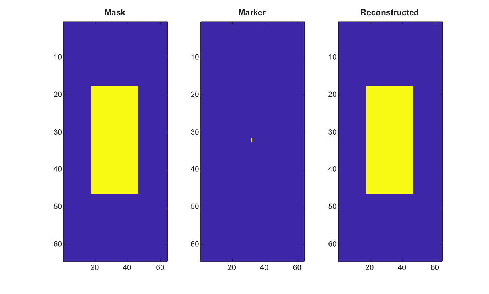

# imreconstruct

Perform morphological reconstruction by dilation.

## 📝 Syntax

- J = imreconstruct(marker, mask)
- J = imreconstruct(marker, mask, conn)

## 📥 Input argument

- marker - Marker image. Values must be less than or equal to mask values.
- mask - Mask image with the same size as marker.
- conn - Connectivity, either 4, 8, or an equivalent 3-by-3 matrix.

## 📤 Output argument

- J - Reconstructed image, cast like mask.

## 📄 Description

imreconstruct repeatedly dilates marker under the constraint of mask until stability. It supports finite real 2-D grayscale and binary images.

## 💡 Example

Reconstruct a binary component from a marker

```matlab
mask=false(64,64); mask(18:46,18:46)=true;
marker=false(64,64); marker(32,32)=true;
J=imreconstruct(marker,mask,4);
figure; subplot(1,3,1); imagesc(mask); title('Mask');
subplot(1,3,2); imagesc(marker); title('Marker');
subplot(1,3,3); imagesc(J); title('Reconstructed');
```



## 🔗 See also

[imhmin](../../../image_processing/imhmin.md), [imhmax](../../../image_processing/imhmax.md), [imregionalmin](../../../image_processing/imregionalmin.md), [watershed](../../../image_processing/watershed.md).

## 🕔 History

| Version | 📄 Description  |
| ------- | --------------- |
| 2.0.0   | initial version |

<!--
## 👤 Author

Allan CORNET
-->
