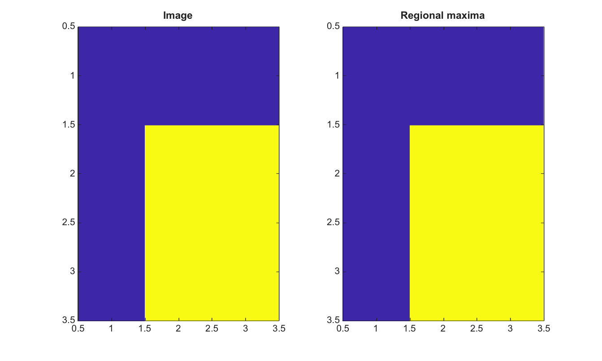

# imregionalmax

Find regional maxima in a 2-D image.

## 📝 Syntax

- BW = imregionalmax(I)
- BW = imregionalmax(I, conn)

## 📥 Input argument

- I - Input finite real 2-D image.
- conn - Connectivity, either 4, 8, or an equivalent 3-by-3 matrix.

## 📤 Output argument

- BW - Logical mask whose true pixels belong to regional maxima.

## 📄 Description

imregionalmax marks connected flat zones that have no higher-valued neighbor under the selected connectivity.

## 💡 Example

Find regional maxima

```matlab
I=[1 1 1;1 3 3;1 3 3];
BW=imregionalmax(I);
figure; subplot(1,2,1); imagesc(I); title('Image');
subplot(1,2,2); imagesc(BW); title('Regional maxima');
```



## 🔗 See also

[imhmax](../../../image_processing/imhmax.md), [imextendedmax](../../../image_processing/imextendedmax.md), [imregionalmin](../../../image_processing/imregionalmin.md).

## 🕔 History

| Version | 📄 Description  |
| ------- | --------------- |
| 2.0.0   | initial version |

<!--
## 👤 Author

Allan CORNET
-->
