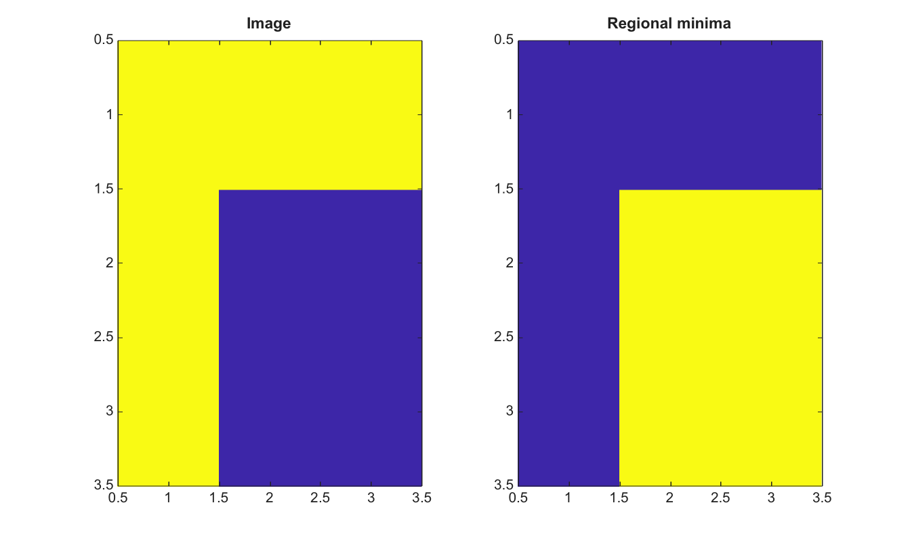

# imregionalmin

Find regional minima in a 2-D image.

## 📝 Syntax

- BW = imregionalmin(I)
- BW = imregionalmin(I, conn)

## 📥 Input argument

- I - Input finite real 2-D image.
- conn - Connectivity, either 4, 8, or an equivalent 3-by-3 matrix.

## 📤 Output argument

- BW - Logical mask whose true pixels belong to regional minima.

## 📄 Description


imregionalmin marks connected flat zones that have no lower-valued neighbor under the selected connectivity. It is useful for inspecting natural markers before watershed segmentation.

## 💡 Example

Find regional minima

```matlab
I=[2 2 2;2 1 1;2 1 1];
BW=imregionalmin(I);
figure; subplot(1,2,1); imagesc(I); title('Image');
subplot(1,2,2); imagesc(BW); title('Regional minima');
```



## 🔗 See also

[imhmin](../../../image_processing/2_image_analysis/7_segmentation/imhmin.md), [imextendedmin](../../../image_processing/2_image_analysis/7_segmentation/imextendedmin.md), [imimposemin](../../../image_processing/2_image_analysis/7_segmentation/imimposemin.md), [watershed](../../../image_processing/2_image_analysis/7_segmentation/watershed.md).

## 🕔 History

| Version | 📄 Description     |
| ------- | --------------- |
| 2.0.0   | initial version |

<!--
## 👤 Author

Allan CORNET
-->
