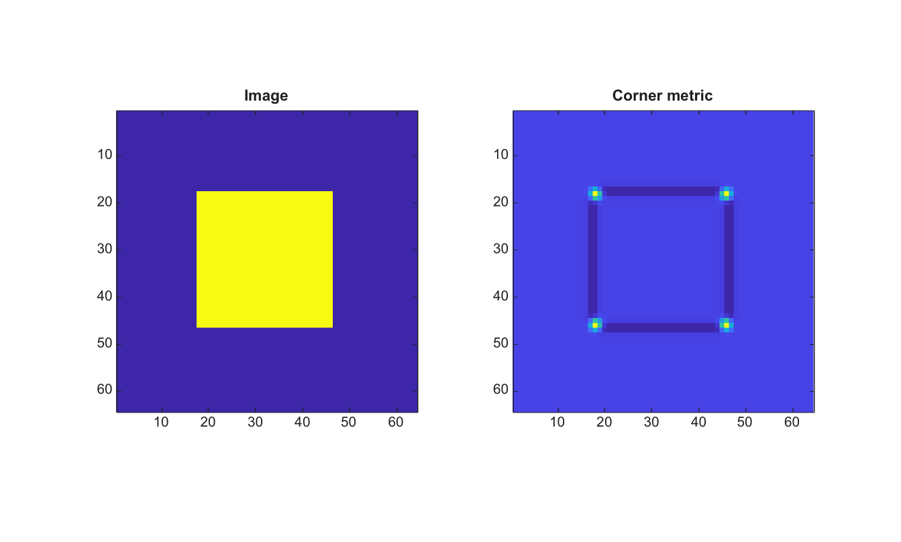

# cornermetric

Compute a corner strength metric.

## 📝 Syntax

- C = cornermetric(I)
- C = cornermetric(I, method)
- C = cornermetric(..., Name, Value)

## 📥 Input argument

- I - Input grayscale or RGB image.
- method - Corner metric method: Harris or Minimum Eigenvalue.

## 📤 Output argument

- C - Corner metric image.

## 📄 Description


cornermetric computes a 2-D corner response from image gradients smoothed by a Gaussian window. Supported name-value options are FilterSize and SensitivityFactor.

## 💡 Example

Display a Harris corner metric

```matlab
I=zeros(64,64); I(18:46,18:46)=1;
C=cornermetric(I);
figure; subplot(1,2,1); imagesc(I); axis image; title('Image');
subplot(1,2,2); imagesc(C); axis image; title('Corner metric');
```



## 🔗 See also

[detectHarrisFeatures](../../../image_processing/2_image_analysis/9_feature_detection/detectHarrisFeatures.md), [detectFASTFeatures](../../../image_processing/2_image_analysis/9_feature_detection/detectFASTFeatures.md).

## 🕔 History

| Version | 📄 Description     |
| ------- | --------------- |
| 2.0.0   | initial version |

<!--
## 👤 Author

Allan CORNET
-->
