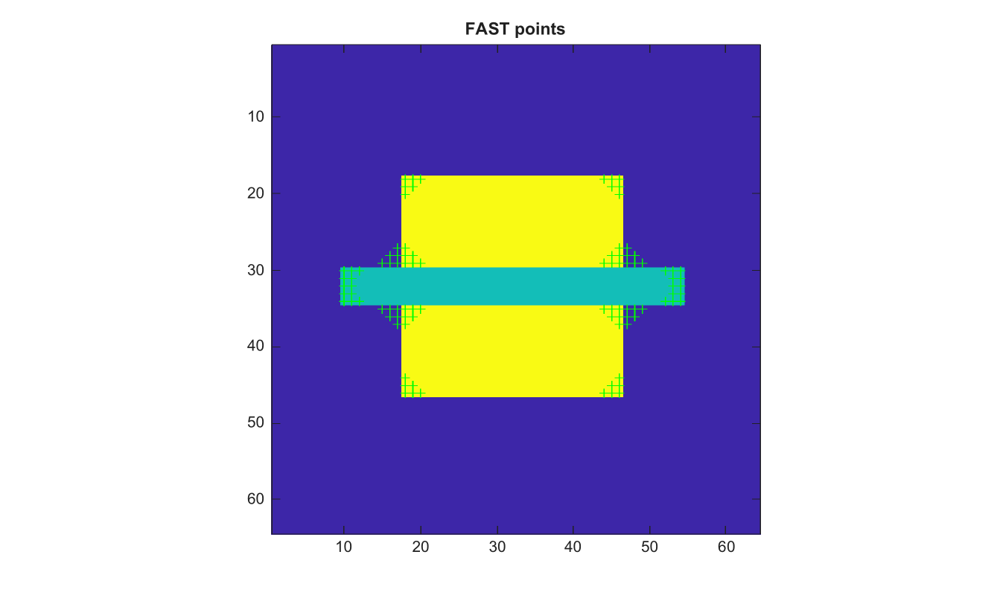

# detectFASTFeatures

Detect FAST corner features.

## 📝 Syntax

- points = detectFASTFeatures(I)
- points = detectFASTFeatures(I, Name, Value)

## 📥 Input argument

- I - Input grayscale or RGB image.

## 📤 Output argument

- points - Structure with Location, Metric and Count fields.

## 📄 Description

detectFASTFeatures applies a FAST-9 style circle test and returns local feature coordinates sorted by contrast strength. Supported options are MinContrast, MinQuality and ROI.

## 💡 Example

Detect FAST features

```matlab
I=zeros(64,64); I(18:46,18:46)=1; I(30:34,10:54)=0.5;
points=detectFASTFeatures(I,'MinContrast',0.2);
figure; imagesc(I); axis image; hold on;
plot(points.Location(:,1),points.Location(:,2),'g+'); title('FAST points');
```



## 🔗 See also

[cornermetric](../../../image_processing/cornermetric.md), [detectHarrisFeatures](../../../image_processing/detectHarrisFeatures.md).

## 🕔 History

| Version | 📄 Description  |
| ------- | --------------- |
| 2.0.0   | initial version |

<!--
## 👤 Author

Allan CORNET
-->
