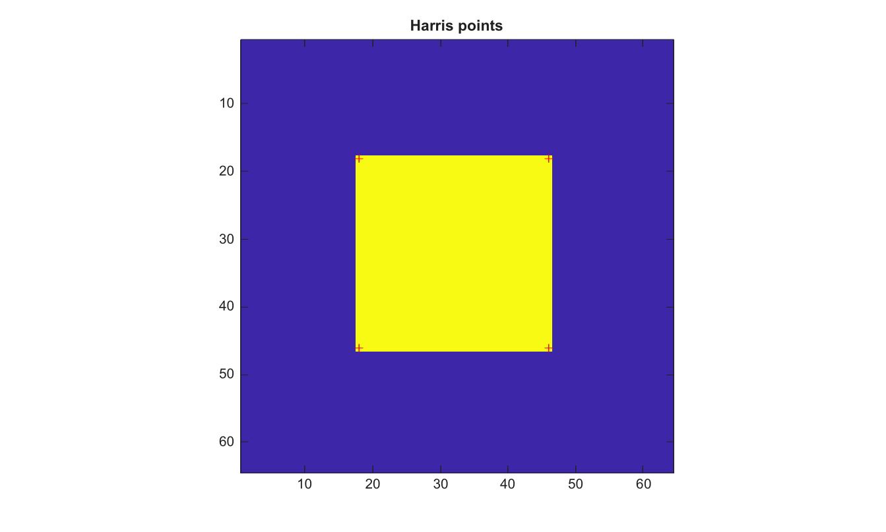

# detectHarrisFeatures

Detect Harris corner features.

## 📝 Syntax

- points = detectHarrisFeatures(I)
- points = detectHarrisFeatures(I, Name, Value)

## 📥 Input argument

- I - Input grayscale or RGB image.

## 📤 Output argument

- points - Structure with Location, Metric and Count fields.

## 📄 Description


detectHarrisFeatures computes a Harris corner metric, keeps local maxima, sorts them by metric strength, and returns their image coordinates. Supported options are MinQuality, FilterSize, SensitivityFactor and ROI.

## 💡 Example

Detect corners in a square image

```matlab
I=zeros(64,64); I(18:46,18:46)=1;
points=detectHarrisFeatures(I,'MinQuality',0.05);
figure; imagesc(I); axis image; hold on;
plot(points.Location(:,1),points.Location(:,2),'r+'); title('Harris points');
```



## 🔗 See also

[cornermetric](../../../image_processing/2_image_analysis/9_feature_detection/cornermetric.md), [detectFASTFeatures](../../../image_processing/2_image_analysis/9_feature_detection/detectFASTFeatures.md).

## 🕔 History

| Version | 📄 Description     |
| ------- | --------------- |
| 2.0.0   | initial version |

<!--
## 👤 Author

Allan CORNET
-->
