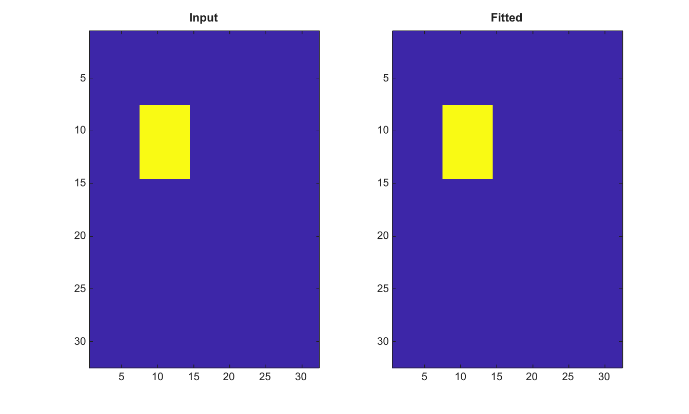

# fitgeotrans

Fit a 2-D geometric transformation from control points.

## 📝 Syntax

- tform = fitgeotrans(movingPoints, fixedPoints, transformType)

## 📥 Input argument

- movingPoints - N-by-2 numeric array of control points in the moving image.
- fixedPoints - N-by-2 numeric array of corresponding control points in the fixed image.
- transformType - Transformation type: 'affine' or 'projective'.

## 📤 Output argument

- tform - Fitted affine2d or projective2d transformation structure.

## 📄 Description

Fit affine or projective 2-D transformations from matching N-by-2 control point arrays. Supported transform types are affine and projective.

## 💡 Example

Fit a translation from three control points

```matlab
moving=[0 0;1 0;0 1];
fixed=[8 5;9 5;8 6];
tform=fitgeotrans(moving,fixed,'affine');
I=zeros(32,32); I(8:14,8:14)=1;
J=imwarp(I,tform,'Interpolation','nearest');
figure; subplot(1,2,1); imagesc(I); title('Input');
subplot(1,2,2); imagesc(J); title('Fitted');
```



## 🔗 See also

[affine2d](../../../image_processing/affine2d.md), [projective2d](../../../image_processing/projective2d.md), [imwarp](../../../image_processing/imwarp.md).

## 🕔 History

| Version | 📄 Description  |
| ------- | --------------- |
| 2.0.0   | initial version |

<!--
## 👤 Author

Allan CORNET
-->
