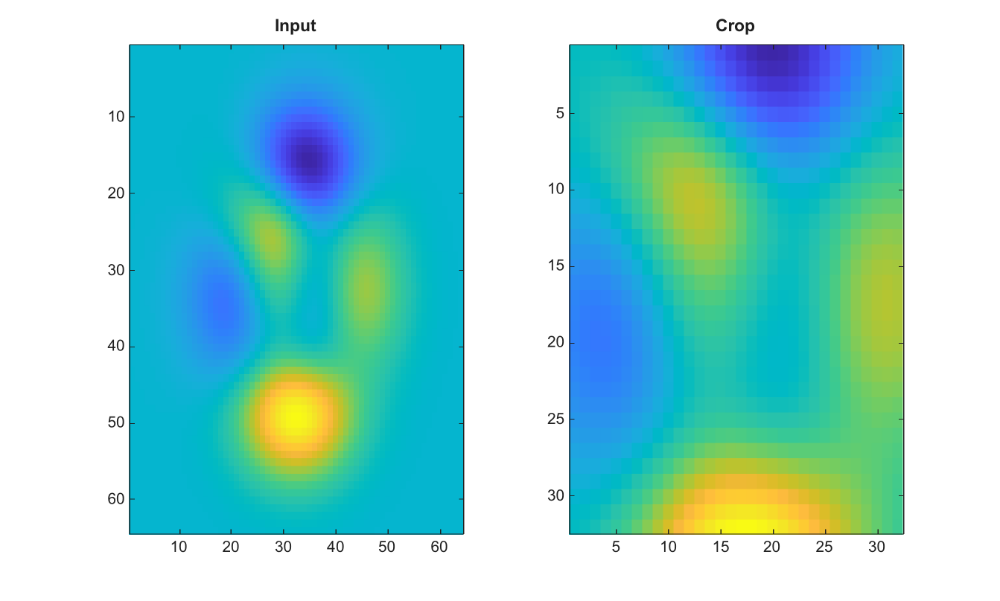

# imcrop

Crop an image using a rectangle.

## 📝 Syntax

- J = imcrop(I)
- J = imcrop(I, rect)

## 📥 Input argument

- I - Input grayscale or RGB image.
- rect - Crop rectangle [x y width height] with nonnegative width and height.

## 📤 Output argument

- J - Cropped image. Without rect, the input image is returned unchanged.

## 📄 Description

Crop an image using a rectangle [x y width height]. The rectangle must be a numeric 4-element vector with nonnegative width and height.

## 💡 Example

Crop an image

```matlab
I=peaks(64);
J=imcrop(I,[16 16 31 31]);
figure; subplot(1,2,1); imagesc(I); title('Input');
subplot(1,2,2); imagesc(J); title('Crop');
```



## 🔗 See also

[imresize](../../../image_processing/imresize.md), [imrotate](../../../image_processing/imrotate.md), [imtranslate](../../../image_processing/imtranslate.md).

## 🕔 History

| Version | 📄 Description  |
| ------- | --------------- |
| 2.0.0   | initial version |

<!--
## 👤 Author

Allan CORNET
-->
