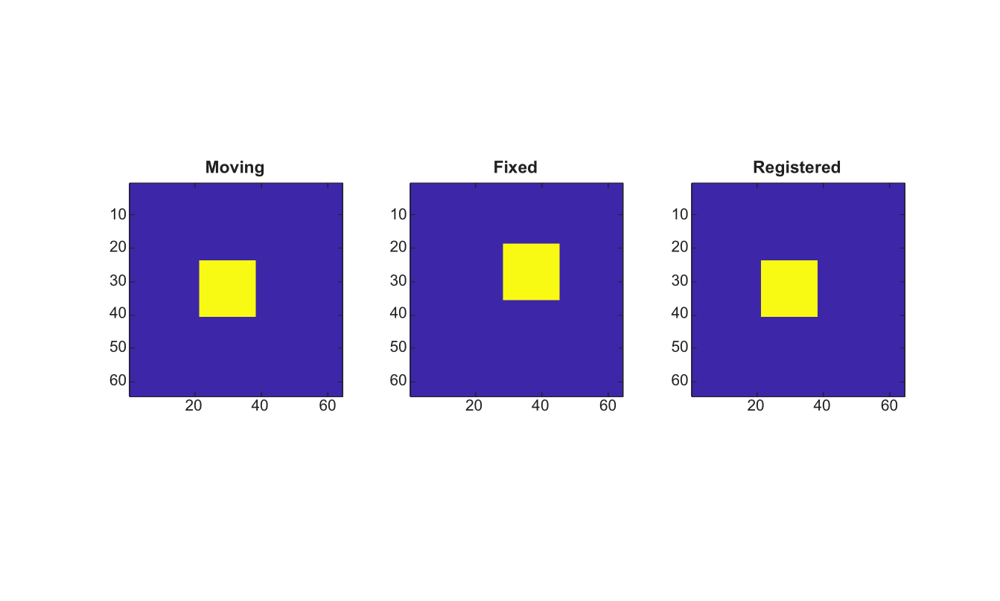

# imregcorr

Estimate a 2-D image registration transform by phase correlation.

## 📝 Syntax

- tform = imregcorr(moving, fixed)
- tform = imregcorr(moving, fixed, transformType)
- [tform, peakcorr] = imregcorr(...)

## 📥 Input argument

- moving - Moving grayscale or RGB image.
- fixed - Fixed grayscale or RGB image with the same size as moving.
- transformType - Transformation type name. Supported values are translation, rigid, similarity and affine. This first implementation estimates the translation component.

## 📤 Output argument

- tform - Affine 2-D transformation structure that maps moving toward fixed.
- peakcorr - Peak value of the normalized phase-correlation surface.

## 📄 Description


imregcorr estimates the integer-pixel translation between two same-size images using normalized phase correlation. RGB inputs are converted to grayscale before registration. The result is returned as an affine2d transformation.

## 💡 Example

Register a translated image

```matlab
I=zeros(64,64); I(24:40,22:38)=1;
J=imtranslate(I,[7 -5],'nearest');
[tform,peakcorr]=imregcorr(I,J);
K=imwarp(I,tform,'nearest');
figure; subplot(1,3,1); imagesc(I); axis image; title('Moving');
subplot(1,3,2); imagesc(J); axis image; title('Fixed');
subplot(1,3,3); imagesc(K); axis image; title('Registered');
```



## 🔗 See also

[affine2d](../../../image_processing/3_geometry_registration_3d/6_geometric_transforms/affine2d.md), [imregconfig](../../../image_processing/3_geometry_registration_3d/6_geometric_transforms/imregconfig.md), [imregister](../../../image_processing/3_geometry_registration_3d/6_geometric_transforms/imregister.md), [imregtform](../../../image_processing/3_geometry_registration_3d/6_geometric_transforms/imregtform.md), [imtranslate](../../../image_processing/3_geometry_registration_3d/6_geometric_transforms/imtranslate.md), [imwarp](../../../image_processing/3_geometry_registration_3d/6_geometric_transforms/imwarp.md).

## 🕔 History

| Version | 📄 Description     |
| ------- | --------------- |
| 2.0.0   | initial version |

<!--
## 👤 Author

Allan CORNET
-->
