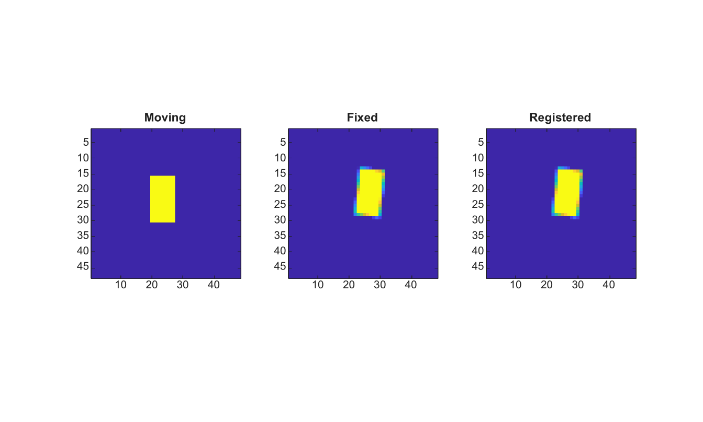

# imregtform

Estimate a 2-D registration transformation from images.

## 📝 Syntax

- tform = imregtform(moving, fixed, transformType, optimizer, metric)
- tform = imregtform(..., Name, Value)

## 📥 Input argument

- moving - Moving grayscale or RGB image.
- fixed - Fixed grayscale or RGB image with the same size as moving.
- transformType - Transformation type: translation, rigid, similarity or affine. The affine mode estimates translation, rotation, independent X/Y scale and shear.
- optimizer - Optimizer structure created by imregconfig or a compatible structure.
- metric - Metric structure or metric name: MeanSquares or Correlation.

## 📤 Output argument

- tform - Affine 2-D transformation structure that maps moving toward fixed.

## 📄 Description


imregtform estimates a small 2-D registration transform without external dependencies. Translation uses phase correlation. Rigid, similarity and affine modes use a deterministic angle, scale and shear search scored by the selected metric.

## 💡 Example

Estimate and apply a rigid registration

```matlab
I=zeros(48,48); I(16:30,20:27)=1;
cx=24.5; cy=24.5; theta=6*pi/180; c=cos(theta); s=sin(theta);
T=[1 0 0;0 1 0;-cx -cy 1]*[c s 0;-s c 0;0 0 1]*[1 0 0;0 1 0;cx cy 1]*[1 0 0;0 1 0;3 -2 1];
J=imwarp(I,T,'linear','OutputView','same');
[optimizer,metric]=imregconfig('monomodal');
optimizer.AngleSearch=10;
tform=imregtform(I,J,'rigid',optimizer,metric);
K=imwarp(I,tform,'linear','OutputView','same');
figure; subplot(1,3,1); imagesc(I); axis image; title('Moving');
subplot(1,3,2); imagesc(J); axis image; title('Fixed');
subplot(1,3,3); imagesc(K); axis image; title('Registered');
```



## 🔗 See also

[imregconfig](../../../image_processing/3_geometry_registration_3d/6_geometric_transforms/imregconfig.md), [imregcorr](../../../image_processing/3_geometry_registration_3d/6_geometric_transforms/imregcorr.md), [imregister](../../../image_processing/3_geometry_registration_3d/6_geometric_transforms/imregister.md), [imwarp](../../../image_processing/3_geometry_registration_3d/6_geometric_transforms/imwarp.md).

## 🕔 History

| Version | 📄 Description     |
| ------- | --------------- |
| 2.0.0   | initial version |

<!--
## 👤 Author

Allan CORNET
-->
