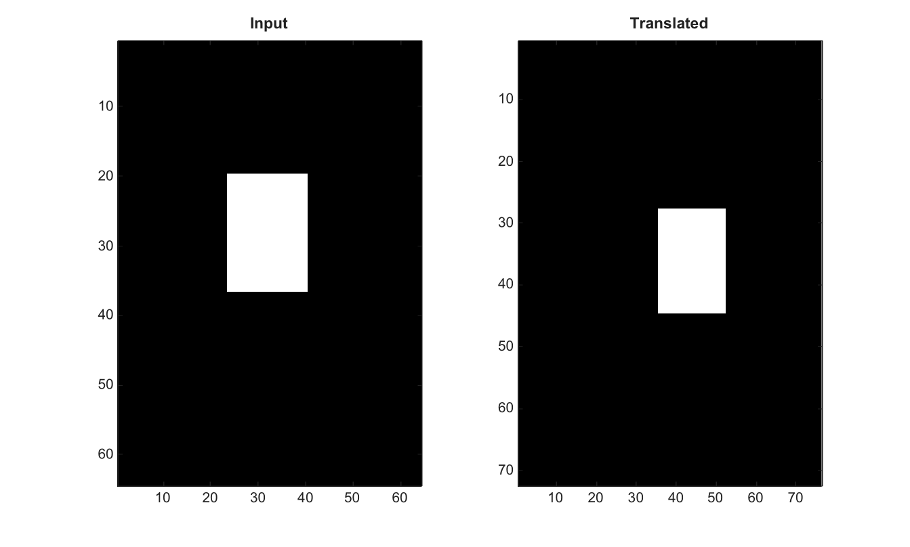

# imtranslate

Translate an image in 2-D.

## 📝 Syntax

- J = imtranslate(I, translation)
- J = imtranslate(I, translation, method)
- J = imtranslate(I, translation, Name, Value)

## 📥 Input argument

- I - Input grayscale or RGB image.
- translation - Two-element translation vector [x y].
- method - Interpolation method: 'nearest', 'linear', 'bilinear', or 'cubic'.
- 'FillValues' - Fill value used outside the input image.
- 'Interpolation' - Named interpolation method override.
- 'OutputView' - Output view: 'same' or 'full'.

## 📤 Output argument

- J - Translated image.

## 📄 Description


Translate an image in 2-D. Supported interpolation methods are nearest, linear, bilinear and cubic. Option names are case-insensitive. OutputView can be same or full.

## 💡 Example

Translate an image

```matlab
I=zeros(64,64); I(20:36,24:40)=1;
J=imtranslate(I,[12 8],'Interpolation','nearest','OutputView','full');
figure; subplot(1,2,1); imagesc(I); g=linspace(0,1,64)'; colormap([g g g]); title('Input');
subplot(1,2,2); imagesc(J); g=linspace(0,1,64)'; colormap([g g g]); title('Translated');
```



## 🔗 See also

[imwarp](../../../image_processing/3_geometry_registration_3d/6_geometric_transforms/imwarp.md), [imcrop](../../../image_processing/3_geometry_registration_3d/6_geometric_transforms/imcrop.md), [imresize](../../../image_processing/3_geometry_registration_3d/6_geometric_transforms/imresize.md).

## 🕔 History

| Version | 📄 Description     |
| ------- | --------------- |
| 2.0.0   | initial version |

<!--
## 👤 Author

Allan CORNET
-->
