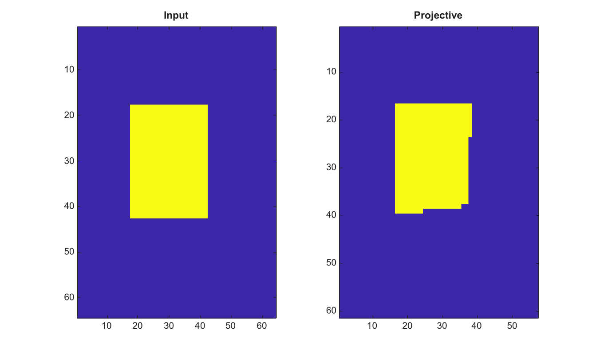

# projective2d

Create a 2-D projective transformation structure.

## 📝 Syntax

- tform = projective2d()
- tform = projective2d(T)

## 📥 Input argument

- T - 3-by-3 finite nonsingular projective transformation matrix. When omitted, the identity transform is returned.

## 📤 Output argument

- tform - Structure with Type, Dimensionality and T fields that can be passed to imwarp.

## 📄 Description


Create a 2-D projective transformation structure containing a nonsingular 3-by-3 matrix T. The structure can be passed to imwarp.

## 💡 Example

Warp an image with a projective transform

```matlab
I=zeros(64,64); I(18:42,18:42)=1;
tform=projective2d([1 0 0.002;0 1 0.001;8 4 1]);
J=imwarp(I,tform,'Interpolation','nearest');
figure; subplot(1,2,1); imagesc(I); title('Input');
subplot(1,2,2); imagesc(J); title('Projective');
```



## 🔗 See also

[affine2d](../../../image_processing/3_geometry_registration_3d/6_geometric_transforms/affine2d.md), [imwarp](../../../image_processing/3_geometry_registration_3d/6_geometric_transforms/imwarp.md), [fitgeotrans](../../../image_processing/3_geometry_registration_3d/6_geometric_transforms/fitgeotrans.md).

## 🕔 History

| Version | 📄 Description     |
| ------- | --------------- |
| 2.0.0   | initial version |

<!--
## 👤 Author

Allan CORNET
-->
