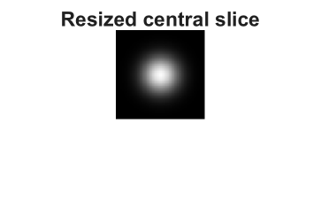

# imresize3

Resize 3-D volume

## 📝 Syntax

- B = imresize3(V, scale)
- B = imresize3(V, [numrows numcols numplanes])
- B = imresize3(\_\_, method)
- B = imresize3(\_\_, Name, Value)

## 📥 Input argument

- V - Input volume, specified as a real nonsparse numeric or logical 3-D array.
- scale - Positive finite scalar resize factor applied to rows, columns, and planes.
- [numrows numcols numplanes] - Output volume size. Values are rounded to positive integer dimensions.
- method - Interpolation method: 'linear' (default) or 'nearest'.
- Name, Value - Supported options are 'Method' and 'Antialiasing'. The antialiasing option is parsed for compatibility.

## 📤 Output argument

- B - Resized volume, returned with the same class as V.

## 📄 Description


<b>imresize3</b> resizes volumetric image data by a scalar scale factor or to an explicit three-element output size. 

The linear method uses separable trilinear interpolation. The nearest method uses nearest-neighbor sampling and preserves logical volumes exactly.

## 💡 Example

Resize a synthetic volume and display a central slice.

```matlab
[X, Y, Z] = meshgrid(linspace(-1, 1, 48), linspace(-1, 1, 40), linspace(-1, 1, 20));
V = exp(-6 * (X .^ 2 + Y .^ 2 + Z .^ 2));
B = imresize3(V, [64 64 32], 'linear');
figure;
imshow(B(:, :, 16), []);
title('Resized central slice');
```



## 🔗 See also

[imgaussfilt3](../../../image_processing/3_geometry_registration_3d/8_volumes_3d/imgaussfilt3.md), [imresize](../../../image_processing/3_geometry_registration_3d/6_geometric_transforms/imresize.md).

## 🕔 History

| Version | 📄 Description     |
| ------- | --------------- |
| 2.0.0   | initial version |

<!--
## 👤 Author

Allan CORNET
-->
