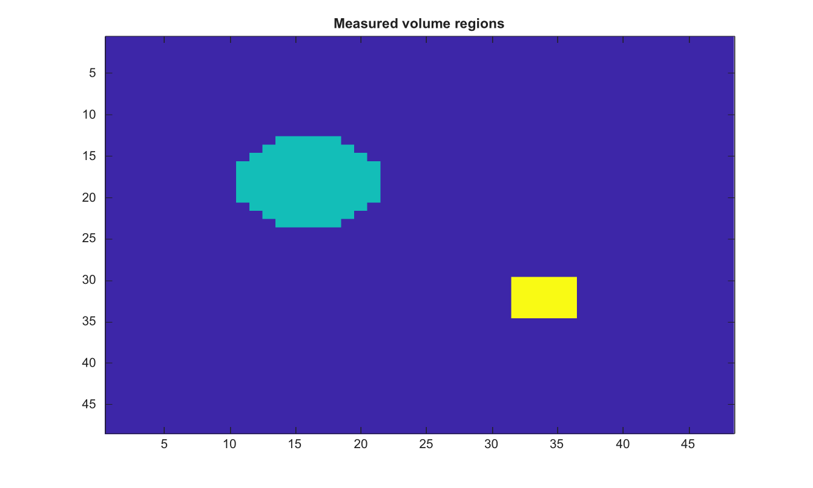

# regionprops3

Measure properties of 3-D volume regions

## 📝 Syntax

- stats = regionprops3(BW)
- stats = regionprops3(CC, properties)
- stats = regionprops3(L, properties)
- stats = regionprops3(regions, V, properties)

## 📥 Input argument

- regions - 3-D logical volume, 3-D nonnegative integer label volume, or connected-component structure from bwconncomp.
- V - Optional intensity volume with the same size as regions.
- properties - Property names, 'basic', 'all', or a cell array of property names.

## 📤 Output argument

- stats - Structure array containing one element per region.

## 📄 Description

<b>regionprops3</b> measures connected regions in 3-D volumes. Supported geometric properties include Volume, Centroid, BoundingBox, VoxelIdxList, VoxelList, Image, SubarrayIdx, Extent, and EquivDiameter.

When an intensity volume is provided, supported intensity properties include MeanIntensity, MinIntensity, MaxIntensity, VoxelValues, and WeightedCentroid.

## 💡 Example

Measure objects in a synthetic volume and display one labeled slice.

```matlab
[X, Y, Z] = meshgrid(1:48, 1:48, 1:20);
BW = ((X - 16) .^ 2 + (Y - 18) .^ 2 + (Z - 8) .^ 2) < 6 ^ 2;
BW = BW | (((X - 34) .^ 2 + (Y - 32) .^ 2 + (Z - 14) .^ 2) < 5 ^ 2);
S = regionprops3(BW, 'Volume', 'Centroid', 'BoundingBox');
L = labelmatrix(bwconncomp(BW));
figure;
imagesc(L(:, :, 10));
title('Measured volume regions');
```



## 🔗 See also

[bwconncomp](../../../image_processing/2_image_analysis/5_regions_boundaries/bwconncomp.md), [regionprops](../../../image_processing/2_image_analysis/5_regions_boundaries/regionprops.md).

## 🕔 History

| Version | 📄 Description  |
| ------- | --------------- |
| 2.0.0   | initial version |

<!--
## 👤 Author

Allan CORNET
-->
