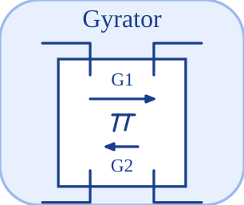

# Gyrator


<p align="center">

</p>
Gyrator: i1 = G2 v2, i2 = -G1 v1 (across<->through transducer).

## 📝 Syntax

- Block type: Gyrator

## 📥 Input argument

- physical pins - 4 undirected physical pin(s); 0 signal input(s).

## 📤 Output argument

- signal ports - 0 signal output(s) (sensor readings).

## 📄 Description


Gyrator: i1 = G2 v2, i2 = -G1 v1 (across<->through transducer). 

| Field | Value |
| --- | --- |
| Module | <code>nflow_blocks</code> | 
| Library | Electrical (acausal) | 
| Type | <code>Gyrator</code> | 
| Label | Gyrator | 
| Solver | Lowered to <code>physicalIsland</code>. Reference solver <code>dae</code> (differential-algebraic); the fixed-step loop and the native explicit solvers (<code>ode1</code>/<code>ode4</code>/<code>ode45</code>) are also supported (a jointed multibody island requires <code>dae</code>). | 

  

<b>Implementation Sources</b> 

**Manifest:** `modules/nflow_blocks/libraries/acausal_electrical/library.json`
 

<details>
<summary>Catalog: <code>modules/nflow_blocks/functions/+NFlow/+internal/acausalCatalog.m</code></summary>

```matlab
  c{end + 1} = entry('Gyrator', 'Electrical', 'electrical', 'physicalIsland', ...
    'gyrator', {{'p1', 'a'}, {'n1', 'b'}, {'p2', 'c'}, {'n2', 'd'}}, ...
    {{'G1', 'G1', 1, 'S'}, {'G2', 'G2', 1, 'S'}}, '', '', ...
    'Gyrator: i1 = G2 v2, i2 = -G1 v1 (across<->through transducer).');
```

</details>


## 🔗 See also

[Ground](../../nflow_blocks/acausal_electrical/Ground.md), [Resistor](../../nflow_blocks/acausal_electrical/Resistor.md), [HeatingResistor](../../nflow_blocks/acausal_electrical/HeatingResistor.md).

## 🕔 History

| Version | 📄 Description     |
| ------- | --------------- |
| 1.0.0   | initial version |

<!--
## 👤 Author

Allan CORNET
-->
