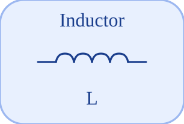

# Inductor


<p align="center">

</p>
Ideal linear inductor: v = L di/dt.

## 📝 Syntax

- Block type: Inductor

## 📥 Input argument

- physical pins - 2 undirected physical pin(s); 0 signal input(s).

## 📤 Output argument

- signal ports - 0 signal output(s) (sensor readings).

## 📄 Description


Ideal linear inductor: v = L di/dt. 

| Field | Value |
| --- | --- |
| Module | <code>nflow_blocks</code> | 
| Library | Electrical (acausal) | 
| Type | <code>Inductor</code> | 
| Label | Inductor | 
| Solver | Lowered to <code>physicalIsland</code>. Reference solver <code>dae</code> (differential-algebraic); the fixed-step loop and the native explicit solvers (<code>ode1</code>/<code>ode4</code>/<code>ode45</code>) are also supported (a jointed multibody island requires <code>dae</code>). | 

  

<b>Implementation Sources</b> 

**Manifest:** `modules/nflow_blocks/libraries/acausal_electrical/library.json`
 

<details>
<summary>Catalog: <code>modules/nflow_blocks/functions/+NFlow/+internal/acausalCatalog.m</code></summary>

```matlab
  c{end + 1} = entry('Inductor', 'Electrical', 'electrical', 'physicalIsland', ...
    'inductor', {{'p', 'a'}, {'n', 'b'}}, ...
    {{'L', 'L', 1e-3, 'H'}, {'i0', 'ic', 0, 'A'}}, '', '', ...
    'Ideal linear inductor: v = L di/dt.');
```

</details>


## 🔗 See also

[Ground](../../nflow_blocks/acausal_electrical/Ground.md), [Resistor](../../nflow_blocks/acausal_electrical/Resistor.md), [HeatingResistor](../../nflow_blocks/acausal_electrical/HeatingResistor.md).

## 🕔 History

| Version | 📄 Description     |
| ------- | --------------- |
| 1.0.0   | initial version |

<!--
## 👤 Author

Allan CORNET
-->
