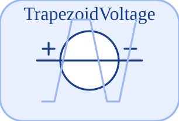

# TrapezoidVoltage


<p align="center">

</p>
Trapezoidal voltage source (continuous ramp-up / hold / ramp-down).

## 📝 Syntax

- Block type: TrapezoidVoltage

## 📥 Input argument

- physical pins - 2 undirected physical pin(s); 0 signal input(s).

## 📤 Output argument

- signal ports - 0 signal output(s) (sensor readings).

## 📄 Description


Trapezoidal voltage source (continuous ramp-up / hold / ramp-down). 

| Field | Value |
| --- | --- |
| Module | <code>nflow_blocks</code> | 
| Library | Electrical (acausal) | 
| Type | <code>TrapezoidVoltage</code> | 
| Label | TrapezoidVoltage | 
| Solver | Lowered to <code>physicalIsland</code>. Reference solver <code>dae</code> (differential-algebraic); the fixed-step loop and the native explicit solvers (<code>ode1</code>/<code>ode4</code>/<code>ode45</code>) are also supported (a jointed multibody island requires <code>dae</code>). | 

  

<b>Implementation Sources</b> 

**Manifest:** `modules/nflow_blocks/libraries/acausal_electrical/library.json`
 

<details>
<summary>Catalog: <code>modules/nflow_blocks/functions/+NFlow/+internal/acausalCatalog.m</code></summary>

```matlab
  c{end + 1} = entry('TrapezoidVoltage', 'Electrical', 'electrical', 'physicalIsland', ...
    'vsource', {{'p', 'a'}, {'n', 'b'}}, ...
    {{'Amplitude', 'Amplitude', 1, 'V'}, {'Rising', 'Rising', 0.2, 's'}, {'Width', 'Width', 0.3, 's'}, ...
     {'Falling', 'Falling', 0.2, 's'}, {'Period', 'Period', 1, 's'}}, ...
    '', '', 'Trapezoidal voltage source (continuous ramp-up / hold / ramp-down).');
```

</details>


## 🔗 See also

[Ground](../../nflow_blocks/acausal_electrical/Ground.md), [Resistor](../../nflow_blocks/acausal_electrical/Resistor.md), [HeatingResistor](../../nflow_blocks/acausal_electrical/HeatingResistor.md).

## 🕔 History

| Version | 📄 Description     |
| ------- | --------------- |
| 1.0.0   | initial version |

<!--
## 👤 Author

Allan CORNET
-->
