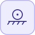

# PlanarRollingWheel


<p align="center">

</p>
Wheel at frame a rolls without slipping on the fixed surface line (px,py)+(dx,dy), staying at height radius.

## 📝 Syntax

- Block type: PlanarRollingWheel

## 📥 Input argument

- physical pins - 1 undirected physical pin(s); 0 signal input(s).

## 📤 Output argument

- signal ports - 0 signal output(s) (sensor readings).

## 📄 Description


Wheel at frame a rolls without slipping on the fixed surface line (px,py)+(dx,dy), staying at height radius. 

| Field | Value |
| --- | --- |
| Module | <code>nflow_blocks</code> | 
| Library | Planar (acausal) | 
| Type | <code>PlanarRollingWheel</code> | 
| Label | PlanarRollingWheel | 
| Solver | Lowered to <code>planarMechanicalIsland</code>. Reference solver <code>dae</code> (differential-algebraic); the fixed-step loop and the native explicit solvers (<code>ode1</code>/<code>ode4</code>/<code>ode45</code>) are also supported (a jointed multibody island requires <code>dae</code>). | 

  

<b>Implementation Sources</b> 

**Manifest:** `modules/nflow_blocks/libraries/acausal_planar/library.json`
 

<details>
<summary>Catalog: <code>modules/nflow_blocks/functions/+NFlow/+internal/planarCatalog.m</code></summary>

```matlab
  c{end + 1} = pl_entry('PlanarRollingWheel', 'Joints', {'a'}, ...
    {{'dx', 1, '1'}, {'dy', 0, '1'}, {'px', 0, 'm'}, {'py', 0, 'm'}, {'radius', 1, 'm'}}, '', ...
    'Wheel at frame a rolls without slipping on the fixed surface line (px,py)+(dx,dy), staying at height radius.');
```

</details>


## 🔗 See also

[PlanarWorld](../../nflow_blocks/acausal_planar/PlanarWorld.md), [PlanarFixed](../../nflow_blocks/acausal_planar/PlanarFixed.md), [PlanarBody](../../nflow_blocks/acausal_planar/PlanarBody.md).

## 🕔 History

| Version | 📄 Description     |
| ------- | --------------- |
| 1.0.0   | initial version |

<!--
## 👤 Author

Allan CORNET
-->
