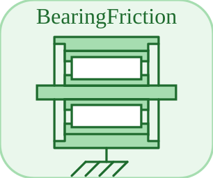

# BearingFriction


<p align="center">

</p>
Regularised bearing friction (event-free): tau = -tau\_c tanh(w / w\_eps).

## 📝 Syntax

- Block type: BearingFriction

## 📥 Input argument

- physical pins - 1 undirected physical pin(s); 0 signal input(s).

## 📤 Output argument

- signal ports - 0 signal output(s) (sensor readings).

## 📄 Description


Regularised bearing friction (event-free): tau = -tau\_c tanh(w / w\_eps). 

| Field | Value |
| --- | --- |
| Module | <code>nflow_blocks</code> | 
| Library | Rotational (acausal) | 
| Type | <code>BearingFriction</code> | 
| Label | BearingFriction | 
| Solver | Lowered to <code>mechanicalTranslationalIsland</code>. Reference solver <code>dae</code> (differential-algebraic); the fixed-step loop and the native explicit solvers (<code>ode1</code>/<code>ode4</code>/<code>ode45</code>) are also supported (a jointed multibody island requires <code>dae</code>). | 

  

<b>Implementation Sources</b> 

**Manifest:** `modules/nflow_blocks/libraries/acausal_rotational/library.json`
 

<details>
<summary>Catalog: <code>modules/nflow_blocks/functions/+NFlow/+internal/acausalCatalog.m</code></summary>

```matlab
  c{end + 1} = entry('BearingFriction', 'Rotational', 'rotational', 'mechanicalTranslationalIsland', ...
    'friction', {{'flange', 'node'}}, {{'tau_c', 'Fc', 1, 'N.m'}, {'w_eps', 'vEps', 0.001, 'rad/s'}}, '', '', ...
    'Regularised bearing friction (event-free): tau = -tau_c tanh(w / w_eps).');
```

</details>


## 🔗 See also

[EMF](../../nflow_blocks/acausal_rotational/EMF.md), [Inertia](../../nflow_blocks/acausal_rotational/Inertia.md), [RotSpring](../../nflow_blocks/acausal_rotational/RotSpring.md).

## 🕔 History

| Version | 📄 Description     |
| ------- | --------------- |
| 1.0.0   | initial version |

<!--
## 👤 Author

Allan CORNET
-->
