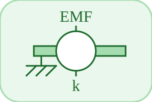

# EMF


<p align="center">

</p>
Electro-mechanical converter (motor/generator): back-emf v = k w, torque tau = k i.

## 📝 Syntax

- Block type: EMF

## 📥 Input argument

- physical pins - 3 undirected physical pin(s); 0 signal input(s).

## 📤 Output argument

- signal ports - 0 signal output(s) (sensor readings).

## 📄 Description


Electro-mechanical converter (motor/generator): back-emf v = k w, torque tau = k i. 

| Field | Value |
| --- | --- |
| Module | <code>nflow_blocks</code> | 
| Library | Rotational (acausal) | 
| Type | <code>EMF</code> | 
| Label | EMF | 
| Solver | Lowered to <code>mechanicalTranslationalIsland</code>. Reference solver <code>dae</code> (differential-algebraic); the fixed-step loop and the native explicit solvers (<code>ode1</code>/<code>ode4</code>/<code>ode45</code>) are also supported (a jointed multibody island requires <code>dae</code>). | 

  

<b>Implementation Sources</b> 

**Manifest:** `modules/nflow_blocks/libraries/acausal_rotational/library.json`
 

<details>
<summary>Catalog: <code>modules/nflow_blocks/functions/+NFlow/+internal/acausalCatalog.m</code></summary>

```matlab
  c{end + 1} = entry('EMF', 'Rotational', 'rotational', 'mechanicalTranslationalIsland', ...
    'force', {{'p', 'a'}, {'n', 'b'}, {'flange', 'node'}}, {{'k', 'k', 1, 'N.m/A'}}, '', '', ...
    'Electro-mechanical converter (motor/generator): back-emf v = k w, torque tau = k i.');
```

</details>


## 🔗 See also

[Inertia](../../nflow_blocks/acausal_rotational/Inertia.md), [RotSpring](../../nflow_blocks/acausal_rotational/RotSpring.md), [RotDamper](../../nflow_blocks/acausal_rotational/RotDamper.md).

## 🕔 History

| Version | 📄 Description     |
| ------- | --------------- |
| 1.0.0   | initial version |

<!--
## 👤 Author

Allan CORNET
-->
