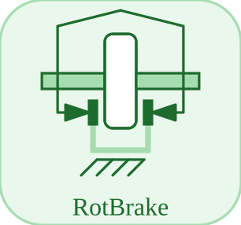

# RotBrake

<p align="center">

</p>
Signal-actuated rotational brake to ground: the input sets the peak braking torque.

## 📝 Syntax

- Block type: RotBrake

## 📥 Input argument

- physical pins - 1 undirected physical pin(s); 1 signal input(s).

## 📤 Output argument

- signal ports - 0 signal output(s) (sensor readings).

## 📄 Description

Signal-actuated rotational brake to ground: the input sets the peak braking torque.

| Field   | Value                                                                                                                                                                                                                                                                                                      |
| ------- | ---------------------------------------------------------------------------------------------------------------------------------------------------------------------------------------------------------------------------------------------------------------------------------------------------------- |
| Module  | <code>nflow_blocks</code>                                                                                                                                                                                                                                                                                  |
| Library | Rotational (acausal)                                                                                                                                                                                                                                                                                       |
| Type    | <code>RotBrake</code>                                                                                                                                                                                                                                                                                      |
| Label   | RotBrake                                                                                                                                                                                                                                                                                                   |
| Solver  | Lowered to <code>mechanicalTranslationalIsland</code>. Reference solver <code>dae</code> (differential-algebraic); the fixed-step loop and the native explicit solvers (<code>ode1</code>/<code>ode4</code>/<code>ode45</code>) are also supported (a jointed multibody island requires <code>dae</code>). |

<b>Implementation Sources</b>

<details>
<summary>Manifest: <code>modules/nflow_blocks/libraries/acausal_rotational/library.json</code></summary>

```json
{
  "id": "builtin.acausal_rotational",
  "title": "Rotational (acausal)",
  "version": "1.0.0",
  "format": "nflow-2",
  "metadata": {
    "author": "Allan CORNET",
    "tool": "Nelson nflow"
  },
  "comment": "Acausal rotational components (physical pins); lower to physicalIsland.",
  "license": "LGPL-3.0",
  "builtin": true,
  "renderModule": false,
  "blocks": [
    {
      "type": "EMF",
      "label": "EMF",
      "acausal": true,
      "domain": "rotational",
      "width": 100,
      "height": 80,
      "physicalPins": [
        {
          "name": "p",
          "x": 0,
          "y": 40,
          "side": "left",
          "domain": "rotational"
        },
        {
          "name": "n",
          "x": 100,
          "y": 40,
          "side": "right",
          "domain": "rotational"
        },
        {
          "name": "flange",
          "x": 50,
          "y": 0,
          "side": "top",
          "domain": "rotational"
        }
      ],
      "inputs": [],
      "outputs": [],
      "defaultParams": {
        "k": 1
      },
      "icon": "EMF.svg",
      "render": {
        "type": "image",
        "src": "EMF.svg"
      },
      "help": "Electro-mechanical converter (motor/generator): back-emf v = k w, torque tau = k i."
    },
    {
      "type": "Inertia",
      "label": "Inertia",
      "acausal": true,
      "domain": "rotational",
      "width": 100,
      "height": 80,
      "physicalPins": [
        {
          "name": "flange",
          "x": 0,
          "y": 40,
          "side": "left",
          "domain": "rotational"
        }
      ],
      "inputs": [],
      "outputs": [],
      "defaultParams": {
        "J": 1,
        "phi0": 0,
        "w0": 0
      },
      "icon": "Inertia.svg",
      "render": {
        "type": "image",
        "src": "Inertia.svg"
      },
      "help": "Rotational inertia: J dw/dt = tau_net."
    },
    {
      "type": "RotSpring",
      "label": "RotSpring",
      "acausal": true,
      "domain": "rotational",
      "width": 100,
      "height": 80,
      "physicalPins": [
        {
          "name": "a",
          "x": 0,
          "y": 40,
          "side": "left",
          "domain": "rotational"
        },
        {
          "name": "b",
          "x": 100,
          "y": 40,
          "side": "right",
          "domain": "rotational"
        }
      ],
      "inputs": [],
      "outputs": [],
      "defaultParams": {
        "c": 1
      },
      "icon": "RotSpring.svg",
      "render": {
        "type": "image",
        "src": "RotSpring.svg"
      },
      "help": "Rotational spring: tau = c (phi_a - phi_b)."
    },
    {
      "type": "RotDamper",
      "label": "RotDamper",
      "acausal": true,
      "domain": "rotational",
      "width": 100,
      "height": 80,
      "physicalPins": [
        {
          "name": "a",
          "x": 0,
          "y": 40,
          "side": "left",
          "domain": "rotational"
        },
        {
          "name": "b",
          "x": 100,
          "y": 40,
          "side": "right",
          "domain": "rotational"
        }
      ],
      "inputs": [],
      "outputs": [],
      "defaultParams": {
        "d": 1
      },
      "icon": "RotDamper.svg",
      "render": {
        "type": "image",
        "src": "RotDamper.svg"
      },
      "help": "Rotational damper: tau = d (w_a - w_b)."
    },
    {
      "type": "ElastoBacklash",
      "label": "ElastoBacklash",
      "acausal": true,
      "domain": "rotational",
      "width": 100,
      "height": 80,
      "physicalPins": [
        {
          "name": "a",
          "x": 0,
          "y": 40,
          "side": "left",
          "domain": "rotational"
        },
        {
          "name": "b",
          "x": 100,
          "y": 40,
          "side": "right",
          "domain": "rotational"
        }
      ],
      "inputs": [],
      "outputs": [],
      "defaultParams": {
        "c": 1,
        "b": 0
      },
      "icon": "ElastoBacklash.svg",
      "render": {
        "type": "image",
        "src": "ElastoBacklash.svg"
      },
      "help": "Rotational backlash: elastic torque with a dead zone of total play b."
    },
    {
      "type": "RotSpringDamper",
      "label": "RotSpringDamper",
      "acausal": true,
      "domain": "rotational",
      "width": 100,
      "height": 80,
      "physicalPins": [
        {
          "name": "a",
          "x": 0,
          "y": 40,
          "side": "left",
          "domain": "rotational"
        },
        {
          "name": "b",
          "x": 100,
          "y": 40,
          "side": "right",
          "domain": "rotational"
        }
      ],
      "inputs": [],
      "outputs": [],
      "defaultParams": {
        "c": 1,
        "d": 1
      },
      "icon": "RotSpringDamper.svg",
      "render": {
        "type": "image",
        "src": "RotSpringDamper.svg"
      },
      "help": "Parallel rotational spring and damper: tau = c (phi_a - phi_b) + d (w_a - w_b)."
    },
    {
      "type": "RotBrake",
      "label": "RotBrake",
      "acausal": true,
      "domain": "rotational",
      "width": 100,
      "height": 80,
      "physicalPins": [
        {
          "name": "flange",
          "x": 0,
          "y": 40,
          "side": "left",
          "domain": "rotational"
        }
      ],
      "inputs": [
        {
          "x": 50,
          "y": 0,
          "side": "top",
          "name": "f"
        }
      ],
      "outputs": [],
      "defaultParams": {
        "w_eps": 0.001
      },
      "icon": "RotBrake.svg",
      "render": {
        "type": "image",
        "src": "RotBrake.svg"
      },
      "help": "Signal-actuated rotational brake to ground: the input sets the peak braking torque."
    },
    {
      "type": "BearingFriction",
      "label": "BearingFriction",
      "acausal": true,
      "domain": "rotational",
      "width": 100,
      "height": 80,
      "physicalPins": [
        {
          "name": "flange",
          "x": 0,
          "y": 40,
          "side": "left",
          "domain": "rotational"
        }
      ],
      "inputs": [],
      "outputs": [],
      "defaultParams": {
        "tau_c": 1,
        "w_eps": 0.001
      },
      "icon": "BearingFriction.svg",
      "render": {
        "type": "image",
        "src": "BearingFriction.svg"
      },
      "help": "Regularised bearing friction (event-free): tau = -tau_c tanh(w / w_eps)."
    },
    {
      "type": "LinearSpeedDependentTorque",
      "label": "LinearSpeedDependentTorque",
      "acausal": true,
      "domain": "rotational",
      "width": 100,
      "height": 80,
      "physicalPins": [
        {
          "name": "flange",
          "x": 0,
          "y": 40,
          "side": "left",
          "domain": "rotational"
        }
      ],
      "inputs": [],
      "outputs": [],
      "defaultParams": {
        "d": 1
      },
      "icon": "LinearSpeedDependentTorque.svg",
      "render": {
        "type": "image",
        "src": "LinearSpeedDependentTorque.svg"
      },
      "help": "Speed-proportional resistance to ground: tau = -d w."
    },
    {
      "type": "QuadraticSpeedDependentTorque",
      "label": "QuadraticSpeedDependentTorque",
      "acausal": true,
      "domain": "rotational",
      "width": 100,
      "height": 80,
      "physicalPins": [
        {
          "name": "flange",
          "x": 0,
          "y": 40,
          "side": "left",
          "domain": "rotational"
        }
      ],
      "inputs": [],
      "outputs": [],
      "defaultParams": {
        "d": 1
      },
      "icon": "QuadraticSpeedDependentTorque.svg",
      "render": {
        "type": "image",
        "src": "QuadraticSpeedDependentTorque.svg"
      },
      "help": "Quadratic (drag) resistance to ground: tau = -d w |w|."
    },
    {
      "type": "Freewheel",
      "label": "Freewheel",
      "acausal": true,
      "domain": "rotational",
      "width": 100,
      "height": 80,
      "physicalPins": [
        {
          "name": "a",
          "x": 0,
          "y": 40,
          "side": "left",
          "domain": "rotational"
        },
        {
          "name": "b",
          "x": 100,
          "y": 40,
          "side": "right",
          "domain": "rotational"
        }
      ],
      "inputs": [],
      "outputs": [],
      "defaultParams": {
        "d": 100,
        "w_eps": 0.001
      },
      "icon": "Freewheel.svg",
      "render": {
        "type": "image",
        "src": "Freewheel.svg"
      },
      "help": "One-way clutch: couples flange a to b only while a overruns b (freewheels otherwise)."
    },
    {
      "type": "Clutch",
      "label": "Clutch",
      "acausal": true,
      "domain": "rotational",
      "width": 100,
      "height": 80,
      "physicalPins": [
        {
          "name": "a",
          "x": 0,
          "y": 40,
          "side": "left",
          "domain": "rotational"
        },
        {
          "name": "b",
          "x": 100,
          "y": 40,
          "side": "right",
          "domain": "rotational"
        }
      ],
      "inputs": [],
      "outputs": [],
      "defaultParams": {
        "tau_max": 1,
        "w_eps": 0.001
      },
      "icon": "Clutch.svg",
      "render": {
        "type": "image",
        "src": "Clutch.svg"
      },
      "help": "Rotational clutch (event-free stick-slip): tau = tau_max tanh((w_a - w_b) / w_eps) reduces the slip toward a common speed."
    },
    {
      "type": "RotFixed",
      "label": "RotFixed",
      "acausal": true,
      "domain": "rotational",
      "width": 100,
      "height": 80,
      "physicalPins": [
        {
          "name": "flange",
          "x": 0,
          "y": 40,
          "side": "left",
          "domain": "rotational"
        }
      ],
      "inputs": [],
      "outputs": [],
      "defaultParams": {
        "phi0": 0
      },
      "icon": "RotFixed.svg",
      "render": {
        "type": "image",
        "src": "RotFixed.svg"
      },
      "help": "Flange fixed at a prescribed angle phi0."
    },
    {
      "type": "IdealGear",
      "label": "IdealGear",
      "acausal": true,
      "domain": "rotational",
      "width": 100,
      "height": 80,
      "physicalPins": [
        {
          "name": "a",
          "x": 0,
          "y": 40,
          "side": "left",
          "domain": "rotational"
        },
        {
          "name": "b",
          "x": 100,
          "y": 40,
          "side": "right",
          "domain": "rotational"
        }
      ],
      "inputs": [],
      "outputs": [],
      "defaultParams": {
        "ratio": 1
      },
      "icon": "IdealGear.svg",
      "render": {
        "type": "image",
        "src": "IdealGear.svg"
      },
      "help": "Ideal gear phi_a = ratio phi_b (structural node merge, inertia folded)."
    },
    {
      "type": "Torque",
      "label": "Torque",
      "acausal": true,
      "domain": "rotational",
      "width": 100,
      "height": 80,
      "physicalPins": [
        {
          "name": "flange",
          "x": 0,
          "y": 40,
          "side": "left",
          "domain": "rotational"
        }
      ],
      "inputs": [
        {
          "x": 50,
          "y": 0,
          "side": "top",
          "name": "F"
        }
      ],
      "outputs": [],
      "defaultParams": {},
      "icon": "Torque.svg",
      "render": {
        "type": "image",
        "src": "Torque.svg"
      },
      "help": "External torque on a flange, driven by the input signal."
    },
    {
      "type": "Torque2",
      "label": "Torque2",
      "acausal": true,
      "domain": "rotational",
      "width": 100,
      "height": 80,
      "physicalPins": [
        {
          "name": "a",
          "x": 0,
          "y": 40,
          "side": "left",
          "domain": "rotational"
        },
        {
          "name": "b",
          "x": 100,
          "y": 40,
          "side": "right",
          "domain": "rotational"
        }
      ],
      "inputs": [
        {
          "x": 50,
          "y": 0,
          "side": "top",
          "name": "F"
        }
      ],
      "outputs": [],
      "defaultParams": {},
      "icon": "Torque2.svg",
      "render": {
        "type": "image",
        "src": "Torque2.svg"
      },
      "help": "Equal and opposite torque between two flanges: +tau on a, -tau on b (signal-driven)."
    },
    {
      "type": "ConstantTorque",
      "label": "ConstantTorque",
      "acausal": true,
      "domain": "rotational",
      "width": 100,
      "height": 80,
      "physicalPins": [
        {
          "name": "flange",
          "x": 0,
          "y": 40,
          "side": "left",
          "domain": "rotational"
        }
      ],
      "inputs": [],
      "outputs": [],
      "defaultParams": {
        "tau": 0
      },
      "icon": "ConstantTorque.svg",
      "render": {
        "type": "image",
        "src": "ConstantTorque.svg"
      },
      "help": "Constant torque on a flange."
    },
    {
      "type": "SineTorque",
      "label": "SineTorque",
      "acausal": true,
      "domain": "rotational",
      "width": 100,
      "height": 80,
      "physicalPins": [
        {
          "name": "flange",
          "x": 0,
          "y": 40,
          "side": "left",
          "domain": "rotational"
        }
      ],
      "inputs": [],
      "outputs": [],
      "defaultParams": {
        "Amplitude": 1,
        "Frequency": 1,
        "Phase": 0
      },
      "icon": "SineTorque.svg",
      "render": {
        "type": "image",
        "src": "SineTorque.svg"
      },
      "help": "Sine torque on a flange: tau = Amplitude sin(2 pi Frequency t + Phase)."
    },
    {
      "type": "RampTorque",
      "label": "RampTorque",
      "acausal": true,
      "domain": "rotational",
      "width": 100,
      "height": 80,
      "physicalPins": [
        {
          "name": "flange",
          "x": 0,
          "y": 40,
          "side": "left",
          "domain": "rotational"
        }
      ],
      "inputs": [],
      "outputs": [],
      "defaultParams": {
        "Slope": 1,
        "StartTime": 0
      },
      "icon": "RampTorque.svg",
      "render": {
        "type": "image",
        "src": "RampTorque.svg"
      },
      "help": "Ramp torque on a flange: tau = Slope (t - StartTime) for t >= StartTime, else 0."
    },
    {
      "type": "ExpSineTorque",
      "label": "ExpSineTorque",
      "acausal": true,
      "domain": "rotational",
      "width": 100,
      "height": 80,
      "physicalPins": [
        {
          "name": "flange",
          "x": 0,
          "y": 40,
          "side": "left",
          "domain": "rotational"
        }
      ],
      "inputs": [],
      "outputs": [],
      "defaultParams": {
        "Amplitude": 1,
        "Frequency": 2,
        "Damping": 0.5,
        "Phase": 0
      },
      "icon": "ExpSineTorque.svg",
      "render": {
        "type": "image",
        "src": "ExpSineTorque.svg"
      },
      "help": "Exponentially damped sine torque on a flange."
    },
    {
      "type": "TrapezoidTorque",
      "label": "TrapezoidTorque",
      "acausal": true,
      "domain": "rotational",
      "width": 100,
      "height": 80,
      "physicalPins": [
        {
          "name": "flange",
          "x": 0,
          "y": 40,
          "side": "left",
          "domain": "rotational"
        }
      ],
      "inputs": [],
      "outputs": [],
      "defaultParams": {
        "Amplitude": 1,
        "Rising": 0.2,
        "Width": 0.3,
        "Falling": 0.2,
        "Period": 1
      },
      "icon": "TrapezoidTorque.svg",
      "render": {
        "type": "image",
        "src": "TrapezoidTorque.svg"
      },
      "help": "Trapezoidal torque on a flange (continuous ramp-up / hold / ramp-down)."
    },
    {
      "type": "RotAccelerate",
      "label": "RotAccelerate",
      "acausal": true,
      "domain": "rotational",
      "width": 100,
      "height": 80,
      "physicalPins": [
        {
          "name": "flange",
          "x": 0,
          "y": 40,
          "side": "left",
          "domain": "rotational"
        }
      ],
      "inputs": [
        {
          "x": 50,
          "y": 0,
          "side": "top",
          "name": "a"
        }
      ],
      "outputs": [],
      "defaultParams": {
        "phi0": 0,
        "w0": 0
      },
      "icon": "RotAccelerate.svg",
      "render": {
        "type": "image",
        "src": "RotAccelerate.svg"
      },
      "help": "Prescribed motion: the flange angular acceleration follows the input signal."
    },
    {
      "type": "RotSpeed",
      "label": "RotSpeed",
      "acausal": true,
      "domain": "rotational",
      "width": 100,
      "height": 80,
      "physicalPins": [
        {
          "name": "flange",
          "x": 0,
          "y": 40,
          "side": "left",
          "domain": "rotational"
        }
      ],
      "inputs": [
        {
          "x": 50,
          "y": 0,
          "side": "top",
          "name": "w"
        }
      ],
      "outputs": [],
      "defaultParams": {
        "phi0": 0
      },
      "icon": "RotSpeed.svg",
      "render": {
        "type": "image",
        "src": "RotSpeed.svg"
      },
      "help": "Prescribed motion: the flange angular velocity follows the input signal."
    },
    {
      "type": "ConstantRotSpeed",
      "label": "ConstantRotSpeed",
      "acausal": true,
      "domain": "rotational",
      "width": 100,
      "height": 80,
      "physicalPins": [
        {
          "name": "flange",
          "x": 0,
          "y": 40,
          "side": "left",
          "domain": "rotational"
        }
      ],
      "inputs": [],
      "outputs": [],
      "defaultParams": {
        "w": 1,
        "phi0": 0
      },
      "icon": "ConstantRotSpeed.svg",
      "render": {
        "type": "image",
        "src": "ConstantRotSpeed.svg"
      },
      "help": "Prescribed motion: the flange rotates at a constant angular velocity w."
    },
    {
      "type": "AngleSensor",
      "label": "AngleSensor",
      "acausal": true,
      "domain": "rotational",
      "width": 100,
      "height": 80,
      "physicalPins": [
        {
          "name": "flange",
          "x": 0,
          "y": 40,
          "side": "left",
          "domain": "rotational"
        }
      ],
      "inputs": [],
      "outputs": [
        {
          "x": 50,
          "y": 80,
          "side": "bottom",
          "name": "angle"
        }
      ],
      "defaultParams": {},
      "icon": "AngleSensor.svg",
      "render": {
        "type": "image",
        "src": "AngleSensor.svg"
      },
      "help": "Measures the absolute angle of a flange."
    },
    {
      "type": "RotSpeedSensor",
      "label": "RotSpeedSensor",
      "acausal": true,
      "domain": "rotational",
      "width": 100,
      "height": 80,
      "physicalPins": [
        {
          "name": "flange",
          "x": 0,
          "y": 40,
          "side": "left",
          "domain": "rotational"
        }
      ],
      "inputs": [],
      "outputs": [
        {
          "x": 50,
          "y": 80,
          "side": "bottom",
          "name": "speed"
        }
      ],
      "defaultParams": {},
      "icon": "RotSpeedSensor.svg",
      "render": {
        "type": "image",
        "src": "RotSpeedSensor.svg"
      },
      "help": "Measures the absolute angular velocity of a flange."
    },
    {
      "type": "RelAngleSensor",
      "label": "RelAngleSensor",
      "acausal": true,
      "domain": "rotational",
      "width": 100,
      "height": 80,
      "physicalPins": [
        {
          "name": "a",
          "x": 0,
          "y": 40,
          "side": "left",
          "domain": "rotational"
        },
        {
          "name": "b",
          "x": 100,
          "y": 40,
          "side": "right",
          "domain": "rotational"
        }
      ],
      "inputs": [],
      "outputs": [
        {
          "x": 50,
          "y": 80,
          "side": "bottom",
          "name": "angle"
        }
      ],
      "defaultParams": {},
      "icon": "RelAngleSensor.svg",
      "render": {
        "type": "image",
        "src": "RelAngleSensor.svg"
      },
      "help": "Measures the relative angle phi_a - phi_b between two flanges."
    },
    {
      "type": "RelRotSpeedSensor",
      "label": "RelRotSpeedSensor",
      "acausal": true,
      "domain": "rotational",
      "width": 100,
      "height": 80,
      "physicalPins": [
        {
          "name": "a",
          "x": 0,
          "y": 40,
          "side": "left",
          "domain": "rotational"
        },
        {
          "name": "b",
          "x": 100,
          "y": 40,
          "side": "right",
          "domain": "rotational"
        }
      ],
      "inputs": [],
      "outputs": [
        {
          "x": 50,
          "y": 80,
          "side": "bottom",
          "name": "speed"
        }
      ],
      "defaultParams": {},
      "icon": "RelRotSpeedSensor.svg",
      "render": {
        "type": "image",
        "src": "RelRotSpeedSensor.svg"
      },
      "help": "Measures the relative angular velocity w_a - w_b between two flanges."
    }
  ]
}
```

</details>


<details>
<summary>Catalog: <code>modules/nflow_blocks/functions/+NFlow/+internal/acausalCatalog.m</code></summary>

```matlab
  c{end + 1} = entry('RotBrake', 'Rotational', 'rotational', 'mechanicalTranslationalIsland', ...
    'brake', {{'flange', 'node'}}, {{'w_eps', 'vEps', 0.001, 'rad/s'}}, 'f', '', ...
    'Signal-actuated rotational brake to ground: the input sets the peak braking torque.');
```

</details>

## 🔗 See also

[EMF](../../nflow_blocks/acausal_rotational/EMF.md), [Inertia](../../nflow_blocks/acausal_rotational/Inertia.md), [RotSpring](../../nflow_blocks/acausal_rotational/RotSpring.md).

## 🕔 History

| Version | 📄 Description  |
| ------- | --------------- |
| 1.0.0   | initial version |

<!--
## 👤 Author

Allan CORNET
-->
