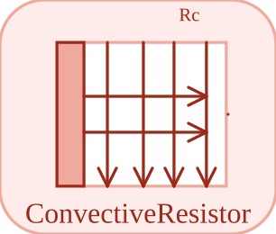

# ConvectiveResistor


<p align="center">

</p>
Convective resistor: Q\_flow = (T\_a - T\_b) / Rc with a signal-driven Rc.

## 📝 Syntax

- Block type: ConvectiveResistor

## 📥 Input argument

- physical pins - 2 undirected physical pin(s); 1 signal input(s).

## 📤 Output argument

- signal ports - 0 signal output(s) (sensor readings).

## 📄 Description


Convective resistor: Q\_flow = (T\_a - T\_b) / Rc with a signal-driven Rc. 

| Field | Value |
| --- | --- |
| Module | <code>nflow_blocks</code> | 
| Library | Thermal (acausal) | 
| Type | <code>ConvectiveResistor</code> | 
| Label | ConvectiveResistor | 
| Solver | Lowered to <code>physicalIsland</code>. Reference solver <code>dae</code> (differential-algebraic); the fixed-step loop and the native explicit solvers (<code>ode1</code>/<code>ode4</code>/<code>ode45</code>) are also supported (a jointed multibody island requires <code>dae</code>). | 

  

<b>Implementation Sources</b> 

**Manifest:** `modules/nflow_blocks/libraries/acausal_thermal/library.json`
 

<details>
<summary>Catalog: <code>modules/nflow_blocks/functions/+NFlow/+internal/acausalCatalog.m</code></summary>

```matlab
  c{end + 1} = entry('ConvectiveResistor', 'Thermal', 'thermal', 'physicalIsland', ...
    'variableResistor', {{'a', 'a'}, {'b', 'b'}}, {}, 'R', '', ...
    'Convective resistor: Q_flow = (T_a - T_b) / Rc with a signal-driven Rc.');
```

</details>


## 🔗 See also

[HeatCapacitor](../../nflow_blocks/acausal_thermal/HeatCapacitor.md), [ThermalConductor](../../nflow_blocks/acausal_thermal/ThermalConductor.md), [ThermalResistor](../../nflow_blocks/acausal_thermal/ThermalResistor.md).

## 🕔 History

| Version | 📄 Description     |
| ------- | --------------- |
| 1.0.0   | initial version |

<!--
## 👤 Author

Allan CORNET
-->
