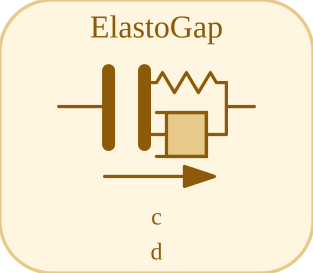

# ElastoGap


<p align="center">

</p>
One-sided contact spring-damper: acts only while the gap is closed (s\_rel < s\_rel0).

## 📝 Syntax

- Block type: ElastoGap

## 📥 Input argument

- physical pins - 2 undirected physical pin(s); 0 signal input(s).

## 📤 Output argument

- signal ports - 0 signal output(s) (sensor readings).

## 📄 Description


One-sided contact spring-damper: acts only while the gap is closed (s\_rel < s\_rel0). 

| Field | Value |
| --- | --- |
| Module | <code>nflow_blocks</code> | 
| Library | Translational (acausal) | 
| Type | <code>ElastoGap</code> | 
| Label | ElastoGap | 
| Solver | Lowered to <code>mechanicalTranslationalIsland</code>. Reference solver <code>dae</code> (differential-algebraic); the fixed-step loop and the native explicit solvers (<code>ode1</code>/<code>ode4</code>/<code>ode45</code>) are also supported (a jointed multibody island requires <code>dae</code>). | 

  

<b>Implementation Sources</b> 

**Manifest:** `modules/nflow_blocks/libraries/acausal_translational/library.json`
 

<details>
<summary>Catalog: <code>modules/nflow_blocks/functions/+NFlow/+internal/acausalCatalog.m</code></summary>

```matlab
  c{end + 1} = entry('ElastoGap', 'Translational', 'translational', 'mechanicalTranslationalIsland', ...
    'elastoGap', {{'a', 'a'}, {'b', 'b'}}, ...
    {{'c', 'c', 100, 'N/m'}, {'d', 'd', 1, 'N.s/m'}, {'s_rel0', 's_rel0', 0, 'm'}}, '', '', ...
    'One-sided contact spring-damper: acts only while the gap is closed (s_rel < s_rel0).');
```

</details>


## 🔗 See also

[TranslationalEMF](../../nflow_blocks/acausal_translational/TranslationalEMF.md), [Mass](../../nflow_blocks/acausal_translational/Mass.md), [SlidingMass](../../nflow_blocks/acausal_translational/SlidingMass.md).

## 🕔 History

| Version | 📄 Description     |
| ------- | --------------- |
| 1.0.0   | initial version |

<!--
## 👤 Author

Allan CORNET
-->
