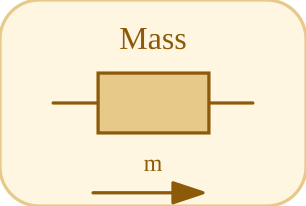

# Mass


<p align="center">

</p>
Sliding mass with inertia: m dv/dt = F\_net.

## 📝 Syntax

- Block type: Mass

## 📥 Input argument

- physical pins - 1 undirected physical pin(s); 0 signal input(s).

## 📤 Output argument

- signal ports - 0 signal output(s) (sensor readings).

## 📄 Description


Sliding mass with inertia: m dv/dt = F\_net. 

| Field | Value |
| --- | --- |
| Module | <code>nflow_blocks</code> | 
| Library | Translational (acausal) | 
| Type | <code>Mass</code> | 
| Label | Mass | 
| Solver | Lowered to <code>mechanicalTranslationalIsland</code>. Reference solver <code>dae</code> (differential-algebraic); the fixed-step loop and the native explicit solvers (<code>ode1</code>/<code>ode4</code>/<code>ode45</code>) are also supported (a jointed multibody island requires <code>dae</code>). | 

  

<b>Implementation Sources</b> 

**Manifest:** `modules/nflow_blocks/libraries/acausal_translational/library.json`
 

<details>
<summary>Catalog: <code>modules/nflow_blocks/functions/+NFlow/+internal/acausalCatalog.m</code></summary>

```matlab
  c{end + 1} = entry('Mass', 'Translational', 'translational', 'mechanicalTranslationalIsland', ...
    'mass', {{'flange', 'node'}}, ...
    {{'m', 'm', 1, 'kg'}, {'s0', 's0', 0, 'm'}, {'v0', 'v0', 0, 'm/s'}}, '', '', ...
    'Sliding mass with inertia: m dv/dt = F_net.');
```

</details>


## 🔗 See also

[TranslationalEMF](../../nflow_blocks/acausal_translational/TranslationalEMF.md), [SlidingMass](../../nflow_blocks/acausal_translational/SlidingMass.md), [MassWithWeight](../../nflow_blocks/acausal_translational/MassWithWeight.md).

## 🕔 History

| Version | 📄 Description     |
| ------- | --------------- |
| 1.0.0   | initial version |

<!--
## 👤 Author

Allan CORNET
-->
