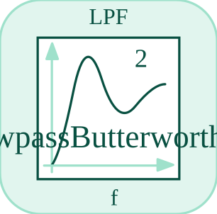

# lpf

<p align="center">

</p>
Applies a first-order low-pass filter.

## 📝 Syntax

- Block type: lpf

## 📥 Input argument

- input ports - 1 input port(s) declared.

## 📤 Output argument

- output ports - 1 output port(s) declared.

## 📄 Description

Applies a first-order low-pass filter.

| Field   | Value                     |
| ------- | ------------------------- |
| Module  | <code>nflow_blocks</code> |
| Library | Continuous blocks         |
| Type    | <code>lpf</code>          |
| Label   | LPF                       |

<b>Description</b>

A first-order low-pass filter. Filters high-frequency components of the input.

<b>Ports</b>

<b>Input(s)</b>

| Port   | Role                              | Side | Position  |
| ------ | --------------------------------- | ---- | --------- |
| Port_1 | Numeric signal read by the block. | left | x=0, y=40 |

<b>Output(s)</b>

| Port   | Role                                  | Side  | Position   |
| ------ | ------------------------------------- | ----- | ---------- |
| Port_1 | Numeric signal produced by the block. | right | x=80, y=40 |

<b>Parameters</b>

| Parameter           | Default value |
| ------------------- | ------------- |
| <code>cutoff</code> | 1             |

<b>Inspector Keys</b>

These serialized keys are exposed by the block inspector.

- <code>cutoff</code>

<b>Block Characteristics</b>

| Field                     | Value                 |
| ------------------------- | --------------------- |
| Block type                | lpf                   |
| Family                    | Continuous blocks     |
| Rendered size             | 80 x 80               |
| Phases                    | INIT, OUTPUT, UPDATE  |
| Direct feedthrough        | see Algorithms        |
| Internal state or history | yes                   |
| Signal data type          | double numeric values |

<b>Algorithms</b>

- INIT clears stored output.
- OUTPUT emits the stored output. UPDATE applies the discrete low-pass update.
- If cutoff is not positive, the output follows the input.

<b>Equation or Rule</b>
$$y_k = y_{k-1} + \alpha\,(u_k - y_{k-1})$$

<b>Extended Capabilities</b>

This page describes the native runtime behavior observed in the module C++ sources. Declared phases indicate when the simulation engine calls the block.

Code generation: supported for C and Rust.

<b>Implementation Sources</b>

<details>
<summary>Manifest: <code>modules/nflow_blocks/libraries/continuous/library.json</code></summary>

```json
{
  "id": "builtin.continuous",
  "title": "Continuous",
  "version": "1.0.0",
  "format": "nflow-2",
  "metadata": {
    "author": "Allan CORNET",
    "created": "2026-03-21",
    "tool": "Nelson nflow"
  },
  "comment": "Blocks for continuous-time systems",
  "license": "LGPL-3.0",
  "builtin": true,
  "blocks": [
    {
      "type": "integrator",
      "label": "Integrator",
      "icon": "integrator.svg",
      "phases": ["INIT", "OUTPUT", "UPDATE"],
      "width": 80,
      "height": 80,
      "inputs": [
        {
          "x": 0,
          "y": 40,
          "side": "left"
        }
      ],
      "outputs": [
        {
          "x": 80,
          "y": 40,
          "side": "right"
        }
      ],
      "defaultParams": {
        "InitialCondition": 0,
        "ExternalReset": "none",
        "InitialConditionSource": "internal",
        "LowerSaturationLimit": "-inf",
        "UpperSaturationLimit": "inf"
      },
      "render": {
        "type": "math",
        "useRectElement": true,
        "bodyClass": "block-body integrator-body",
        "mathGroupClass": "integrator-math",
        "formula": "\\frac{1}{s}"
      }
    },
    {
      "type": "tf",
      "label": "Transfer Fn",
      "icon": "tf.svg",
      "phases": ["INIT", "OUTPUT", "ALGEBRAIC", "UPDATE"],
      "width": 85,
      "height": 80,
      "inputs": [
        {
          "x": 0,
          "y": 40,
          "side": "left"
        }
      ],
      "outputs": [
        {
          "x": 85,
          "y": 40,
          "side": "right"
        }
      ],
      "defaultParams": {
        "Numerator": [3],
        "Denominator": [1, 3]
      },
      "render": {
        "type": "math",
        "bodyClass": "block-body",
        "mathGroupClass": "tf-math",
        "formula": "\\frac{N(s)}{D(s)}"
      }
    },
    {
      "type": "delay",
      "label": "Delay",
      "icon": "delay.svg",
      "phases": ["INIT", "OUTPUT", "UPDATE"],
      "width": 80,
      "height": 80,
      "inputs": [
        {
          "x": 0,
          "y": 40,
          "side": "left"
        }
      ],
      "outputs": [
        {
          "x": 80,
          "y": 40,
          "side": "right"
        }
      ],
      "defaultParams": {
        "DelayTime": 0.1
      },
      "render": {
        "type": "math",
        "bodyClass": "block-body",
        "mathGroupClass": "delay-math",
        "formula": "e^{-sT}"
      }
    },
    {
      "type": "stateSpace",
      "label": "State-Space",
      "icon": "stateSpace.svg",
      "phases": ["INIT", "OUTPUT", "UPDATE"],
      "width": 160,
      "height": 80,
      "inputs": [
        {
          "x": 0,
          "y": 40,
          "side": "left"
        }
      ],
      "outputs": [
        {
          "x": 160,
          "y": 40,
          "side": "right"
        }
      ],
      "defaultParams": {
        "A": 1,
        "B": 1,
        "C": 1,
        "D": 0,
        "InitialCondition": 0
      },
      "render": {
        "type": "math",
        "bodyClass": "block-body",
        "mathGroupClass": "state-space-math",
        "formula": "\\dot{x}=Ax+Bu",
        "textSize": "16px"
      }
    },
    {
      "type": "lpf",
      "label": "LPF",
      "icon": "lpf.svg",
      "phases": ["INIT", "OUTPUT", "UPDATE"],
      "width": 80,
      "height": 80,
      "inputs": [
        {
          "x": 0,
          "y": 40,
          "side": "left"
        }
      ],
      "outputs": [
        {
          "x": 80,
          "y": 40,
          "side": "right"
        }
      ],
      "defaultParams": {
        "Cutoff": 1
      },
      "render": {
        "src": "lpf.svg",
        "type": "image"
      }
    },
    {
      "type": "hpf",
      "label": "HPF",
      "icon": "hpf.svg",
      "phases": ["INIT", "OUTPUT", "UPDATE"],
      "width": 80,
      "height": 80,
      "inputs": [
        {
          "x": 0,
          "y": 40,
          "side": "left"
        }
      ],
      "outputs": [
        {
          "x": 80,
          "y": 40,
          "side": "right"
        }
      ],
      "defaultParams": {
        "Cutoff": 1
      },
      "render": {
        "src": "hpf.svg",
        "type": "image"
      }
    },
    {
      "type": "derivative",
      "label": "Derivative",
      "icon": "derivative.svg",
      "phases": ["INIT", "OUTPUT", "UPDATE"],
      "width": 80,
      "height": 80,
      "inputs": [
        {
          "x": 0,
          "y": 40,
          "side": "left"
        }
      ],
      "outputs": [
        {
          "x": 80,
          "y": 40,
          "side": "right"
        }
      ],
      "defaultParams": {},
      "render": {
        "type": "math",
        "useRectElement": true,
        "bodyClass": "block-body",
        "mathGroupClass": "derivative-math",
        "formula": "\\frac{d}{dt}"
      }
    },
    {
      "type": "pid",
      "label": "PID",
      "icon": "pid.svg",
      "phases": ["INIT", "OUTPUT", "UPDATE"],
      "width": 80,
      "height": 80,
      "inputs": [
        {
          "x": 0,
          "y": 40,
          "side": "left"
        }
      ],
      "outputs": [
        {
          "x": 80,
          "y": 40,
          "side": "right"
        }
      ],
      "defaultParams": {
        "P": 1,
        "I": 0,
        "D": 0,
        "N": 0,
        "LowerSaturationLimit": "-inf",
        "UpperSaturationLimit": "inf"
      },
      "render": {
        "type": "math",
        "bodyClass": "block-body",
        "mathGroupClass": "pid-math",
        "formula": "\\mathsf{PID}"
      }
    },
    {
      "type": "constraint",
      "label": "Constraint",
      "icon": "constraint.svg",
      "phases": ["INIT", "OUTPUT", "DERIVATIVE"],
      "width": 80,
      "height": 80,
      "inputs": [
        {
          "x": 0,
          "y": 40,
          "side": "left"
        }
      ],
      "outputs": [
        {
          "x": 80,
          "y": 40,
          "side": "right"
        }
      ],
      "defaultParams": {
        "InitialCondition": 0
      },
      "render": {
        "type": "math",
        "bodyClass": "block-body",
        "mathGroupClass": "constraint-math",
        "formula": "g=0"
      }
    }
  ]
}
```

</details>


<details>
<summary>Runtime: <code>modules/nflow_blocks/src/cpp/continuous/lpf.cpp</code></summary>

```cpp
//=============================================================================
// Copyright (c) 2016-present Allan CORNET (Nelson)
//=============================================================================
// This file is part of Nelson.
//=============================================================================
// LICENCE_BLOCK_BEGIN
// SPDX-License-Identifier: LGPL-3.0-or-later
// LICENCE_BLOCK_END
//=============================================================================
#include "SimEngineTypes.hpp"
#include "BlockRegistry.hpp"
#include "FieldNames.hpp"
#include "NFlowBlockDescriptor.hpp"
#include "NFlowCodegenPolynomial.hpp"
#include "NFlowCodegenHelpers.hpp"
#include "NFlowCodegenLang.hpp"
#include <cmath>
#include <algorithm>
#include "continuous_blocks.hpp"
//=============================================================================
bool
Nelson::NFlow::handleLpf(SimCtx& ctx, const Block& b, Phase phase)
{
    auto& st = getState(ctx, b.nid);
    const int w = outputWidth(ctx, b.nid, 0);
    if (phase == Phase::INIT) {
        st.scalar = 0.0;
        st.output = 0.0;
        if (w > 1) {
            st.vec.assign(w, 0.0);
        }
        return false;
    }
    if (phase == Phase::OUTPUT) {
        // Variable-step minor step: y = x (the low-pass state) read from the
        // scattered global state; else the latched value (fixed-step path).
        double* xs = blockX(ctx, b.nid);
        if (w <= 1) {
            setOutput(ctx, b.nid, xs ? xs[0] : st.output);
        } else {
            double* y = outputSlice(ctx, b.nid, 0);
            for (int i = 0; i < w; ++i) {
                y[i] = xs ? xs[i] : (i < (int)st.vec.size() ? st.vec[i] : 0.0);
            }
        }
        return false;
    }
    if (phase == Phase::UPDATE) {
        nflow::BlockDescriptor bd(b, ctx.variables);
        double fc = std::max(0.0, bd.paramDouble(nflow::kCutoff, 0.0));
        double wc = 2.0 * M_PI * fc;
        if (w <= 1) {
            double inp = getInput(ctx, b.nid, 0, 0.0);
            double next = st.scalar + ctx.dt * wc * (inp - st.scalar);
            st.scalar = next;
            st.output = next;
        } else {
            SigView u = getInputSig(ctx, b.nid, 0);
            if ((int)st.vec.size() != w) {
                st.vec.assign(w, 0.0);
            }
            for (int i = 0; i < w; ++i) {
                st.vec[i] += ctx.dt * wc * (sigAt(u, i) - st.vec[i]);
            }
        }
        return false;
    }
    if (phase == Phase::DERIVATIVE) {
        // Continuous state derivative: x' = wc*(u - x).
        double* xdot = blockXdot(ctx, b.nid);
        if (xdot) {
            nflow::BlockDescriptor bd(b, ctx.variables);
            double fc = std::max(0.0, bd.paramDouble(nflow::kCutoff, 0.0));
            double wc = 2.0 * M_PI * fc;
            double* xs = blockX(ctx, b.nid);
            if (w <= 1) {
                double x = xs ? xs[0] : st.scalar;
                xdot[0] = wc * (getInput(ctx, b.nid, 0, 0.0) - x);
            } else {
                SigView u = getInputSig(ctx, b.nid, 0);
                for (int i = 0; i < w; ++i) {
                    double x = xs ? xs[i] : (i < (int)st.vec.size() ? st.vec[i] : 0.0);
                    xdot[i] = wc * (sigAt(u, i) - x);
                }
            }
        }
        return false;
    }
    return false;
}
//=============================================================================
// Single language-parameterized emitter (CodegenLang): the C and Rust
// templates were byte-for-byte clones apart from the state-field access.
static Nelson::NFlow::BlockCodegenTemplate
makeLpfCodegen(Nelson::NFlow::CodegenLang L)
{
    using namespace Nelson::NFlow;
    BlockCodegenTemplate t;
    // Forward-Euler on x' = wc*(u - x), matching the interpreter (the generators
    // no longer use a Tustin discretization for lpf/hpf/tf). Output-then-update
    // reproduces the interpreter's one-sample-latched output timing.
    t.emitState = [](const BlockCodegenStateArgs& a) { a.addState("lpf_x_" + a.id, "", ""); };
    t.emitStep = [L](const BlockCodegenArgs& a) {
        nflow::BlockDescriptor bd(*a.block, *a.variables);
        double wc = 2.0 * M_PI * std::fmax(0.0, bd.paramDouble(nflow::kCutoff, 0.0));
        const std::string x = L.sref("lpf_x_" + a.id);
        a.line("out_" + a.id + " = " + x + ";");
        a.line(x + " = " + x + " + dt * " + a.fmt(wc) + " * (" + a.in[0] + " - " + x + ");");
    };
    // Unified variable-step codegen (roadmap 5.3): one continuous state with
    // x' = wc*(u - x), output y = x. Joins the shared RK4 rhs so an ode4 model
    // matches its generated code.
    t.continuousWidth = [](const BlockCodegenArgs&) -> int { return 1; };
    t.emitRk4 = [L](const BlockCodegenArgs& a) {
        nflow::BlockDescriptor bd(*a.block, *a.variables);
        const double wc = 2.0 * M_PI * std::fmax(0.0, bd.paramDouble(nflow::kCutoff, 0.0));
        const std::string off = std::to_string(a.stateOffset);
        const std::string x = L.sref("lpf_x_" + a.id);
        switch (a.rk4Op) {
        case Rk4Gather:
            a.line(a.rk4Arr + "[" + off + "] = " + x + ";");
            break;
        case Rk4Scatter:
            a.line(x + " = " + a.rk4Arr + "[" + off + "];");
            break;
        case Rk4Output:
            a.line("out_" + a.id + " = " + x + ";");
            break;
        case Rk4Deriv:
            a.line(a.rk4Arr + "[" + off + "] = " + a.fmt(wc) + " * (" + a.in[0] + " - " + x + ");");
            break;
        default:
            break;
        }
    };
    return t;
}
//=============================================================================
Nelson::NFlow::BlockCodegenTemplate
Nelson::NFlow::getCodeGenCLpf()
{
    return makeLpfCodegen({ false });
}
//=============================================================================
Nelson::NFlow::BlockCodegenTemplate
Nelson::NFlow::getCodeGenRustLpf()
{
    return makeLpfCodegen({ true });
}
//=============================================================================

```

</details>

## 🔗 See also

[hpf](../../nflow_blocks/continuous/hpf.md), [tf](../../nflow_blocks/continuous/tf.md), [derivative](../../nflow_blocks/continuous/derivative.md).

## 🕔 History

| Version | 📄 Description  |
| ------- | --------------- |
| 1.0.0   | initial version |

<!--
## 👤 Author

Allan CORNET
-->
