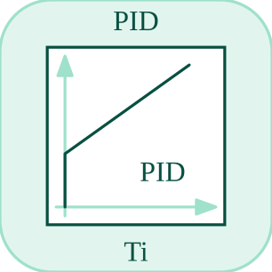

# pid

<p align="center">

</p>
Implements a scalar PID controller with output limits.

## 📝 Syntax

- Block type: pid

## 📥 Input argument

- input ports - 1 input port(s) declared.

## 📤 Output argument

- output ports - 1 output port(s) declared.

## 📄 Description

Implements a scalar PID controller with output limits.

| Field   | Value                     |
| ------- | ------------------------- |
| Module  | <code>nflow_blocks</code> |
| Library | Continuous blocks         |
| Type    | <code>pid</code>          |
| Label   | PID                       |

<b>Description</b>

Proportional-Integral-Derivative controller block. Computes a PID control action from input error.

<b>Ports</b>

<b>Input(s)</b>

| Port   | Role                              | Side | Position  |
| ------ | --------------------------------- | ---- | --------- |
| Port_1 | Numeric signal read by the block. | left | x=0, y=40 |

<b>Output(s)</b>

| Port   | Role                                  | Side  | Position   |
| ------ | ------------------------------------- | ----- | ---------- |
| Port_1 | Numeric signal produced by the block. | right | x=80, y=40 |

<b>Parameters</b>

| Parameter        | Default value |
| ---------------- | ------------- |
| <code>kp</code>  | 1             |
| <code>ki</code>  | 0             |
| <code>kd</code>  | 0             |
| <code>min</code> | -inf          |
| <code>max</code> | inf           |

<b>Inspector Keys</b>

These serialized keys are exposed by the block inspector.

- <code>kp</code>
- <code>ki</code>
- <code>kd</code>
- <code>min</code>
- <code>max</code>

<b>Block Characteristics</b>

| Field                     | Value                 |
| ------------------------- | --------------------- |
| Block type                | pid                   |
| Family                    | Continuous blocks     |
| Rendered size             | 80 x 80               |
| Phases                    | INIT, OUTPUT, UPDATE  |
| Direct feedthrough        | see Algorithms        |
| Internal state or history | yes                   |
| Signal data type          | double numeric values |

<b>Algorithms</b>

- INIT clears integral, previous input, and output.
- OUTPUT emits the stored controller output. UPDATE computes P, I, and D terms from input and dt.
- The result is clamped between min and max.

<b>Equation or Rule</b>
$$y = \operatorname{clamp}\left(k_p u + k_i\int u\,dt + k_d\frac{du}{dt},\,min,\,max\right)$$

<b>Extended Capabilities</b>

This page describes the native runtime behavior observed in the module C++ sources. Declared phases indicate when the simulation engine calls the block.

Code generation: supported for C and Rust.

<b>Implementation Sources</b>

<details>
<summary>Manifest: <code>modules/nflow_blocks/libraries/continuous/library.json</code></summary>

```json
{
  "id": "builtin.continuous",
  "title": "Continuous",
  "version": "1.0.0",
  "format": "nflow-2",
  "metadata": {
    "author": "Allan CORNET",
    "created": "2026-03-21",
    "tool": "Nelson nflow"
  },
  "comment": "Blocks for continuous-time systems",
  "license": "LGPL-3.0",
  "builtin": true,
  "blocks": [
    {
      "type": "integrator",
      "label": "Integrator",
      "icon": "integrator.svg",
      "phases": ["INIT", "OUTPUT", "UPDATE"],
      "width": 80,
      "height": 80,
      "inputs": [
        {
          "x": 0,
          "y": 40,
          "side": "left"
        }
      ],
      "outputs": [
        {
          "x": 80,
          "y": 40,
          "side": "right"
        }
      ],
      "defaultParams": {
        "InitialCondition": 0,
        "ExternalReset": "none",
        "InitialConditionSource": "internal",
        "LowerSaturationLimit": "-inf",
        "UpperSaturationLimit": "inf"
      },
      "render": {
        "type": "math",
        "useRectElement": true,
        "bodyClass": "block-body integrator-body",
        "mathGroupClass": "integrator-math",
        "formula": "\\frac{1}{s}"
      }
    },
    {
      "type": "tf",
      "label": "Transfer Fn",
      "icon": "tf.svg",
      "phases": ["INIT", "OUTPUT", "ALGEBRAIC", "UPDATE"],
      "width": 85,
      "height": 80,
      "inputs": [
        {
          "x": 0,
          "y": 40,
          "side": "left"
        }
      ],
      "outputs": [
        {
          "x": 85,
          "y": 40,
          "side": "right"
        }
      ],
      "defaultParams": {
        "Numerator": [3],
        "Denominator": [1, 3]
      },
      "render": {
        "type": "math",
        "bodyClass": "block-body",
        "mathGroupClass": "tf-math",
        "formula": "\\frac{N(s)}{D(s)}"
      }
    },
    {
      "type": "delay",
      "label": "Delay",
      "icon": "delay.svg",
      "phases": ["INIT", "OUTPUT", "UPDATE"],
      "width": 80,
      "height": 80,
      "inputs": [
        {
          "x": 0,
          "y": 40,
          "side": "left"
        }
      ],
      "outputs": [
        {
          "x": 80,
          "y": 40,
          "side": "right"
        }
      ],
      "defaultParams": {
        "DelayTime": 0.1
      },
      "render": {
        "type": "math",
        "bodyClass": "block-body",
        "mathGroupClass": "delay-math",
        "formula": "e^{-sT}"
      }
    },
    {
      "type": "stateSpace",
      "label": "State-Space",
      "icon": "stateSpace.svg",
      "phases": ["INIT", "OUTPUT", "UPDATE"],
      "width": 160,
      "height": 80,
      "inputs": [
        {
          "x": 0,
          "y": 40,
          "side": "left"
        }
      ],
      "outputs": [
        {
          "x": 160,
          "y": 40,
          "side": "right"
        }
      ],
      "defaultParams": {
        "A": 1,
        "B": 1,
        "C": 1,
        "D": 0,
        "InitialCondition": 0
      },
      "render": {
        "type": "math",
        "bodyClass": "block-body",
        "mathGroupClass": "state-space-math",
        "formula": "\\dot{x}=Ax+Bu",
        "textSize": "16px"
      }
    },
    {
      "type": "lpf",
      "label": "LPF",
      "icon": "lpf.svg",
      "phases": ["INIT", "OUTPUT", "UPDATE"],
      "width": 80,
      "height": 80,
      "inputs": [
        {
          "x": 0,
          "y": 40,
          "side": "left"
        }
      ],
      "outputs": [
        {
          "x": 80,
          "y": 40,
          "side": "right"
        }
      ],
      "defaultParams": {
        "Cutoff": 1
      },
      "render": {
        "src": "lpf.svg",
        "type": "image"
      }
    },
    {
      "type": "hpf",
      "label": "HPF",
      "icon": "hpf.svg",
      "phases": ["INIT", "OUTPUT", "UPDATE"],
      "width": 80,
      "height": 80,
      "inputs": [
        {
          "x": 0,
          "y": 40,
          "side": "left"
        }
      ],
      "outputs": [
        {
          "x": 80,
          "y": 40,
          "side": "right"
        }
      ],
      "defaultParams": {
        "Cutoff": 1
      },
      "render": {
        "src": "hpf.svg",
        "type": "image"
      }
    },
    {
      "type": "derivative",
      "label": "Derivative",
      "icon": "derivative.svg",
      "phases": ["INIT", "OUTPUT", "UPDATE"],
      "width": 80,
      "height": 80,
      "inputs": [
        {
          "x": 0,
          "y": 40,
          "side": "left"
        }
      ],
      "outputs": [
        {
          "x": 80,
          "y": 40,
          "side": "right"
        }
      ],
      "defaultParams": {},
      "render": {
        "type": "math",
        "useRectElement": true,
        "bodyClass": "block-body",
        "mathGroupClass": "derivative-math",
        "formula": "\\frac{d}{dt}"
      }
    },
    {
      "type": "pid",
      "label": "PID",
      "icon": "pid.svg",
      "phases": ["INIT", "OUTPUT", "UPDATE"],
      "width": 80,
      "height": 80,
      "inputs": [
        {
          "x": 0,
          "y": 40,
          "side": "left"
        }
      ],
      "outputs": [
        {
          "x": 80,
          "y": 40,
          "side": "right"
        }
      ],
      "defaultParams": {
        "P": 1,
        "I": 0,
        "D": 0,
        "N": 0,
        "LowerSaturationLimit": "-inf",
        "UpperSaturationLimit": "inf"
      },
      "render": {
        "type": "math",
        "bodyClass": "block-body",
        "mathGroupClass": "pid-math",
        "formula": "\\mathsf{PID}"
      }
    },
    {
      "type": "constraint",
      "label": "Constraint",
      "icon": "constraint.svg",
      "phases": ["INIT", "OUTPUT", "DERIVATIVE"],
      "width": 80,
      "height": 80,
      "inputs": [
        {
          "x": 0,
          "y": 40,
          "side": "left"
        }
      ],
      "outputs": [
        {
          "x": 80,
          "y": 40,
          "side": "right"
        }
      ],
      "defaultParams": {
        "InitialCondition": 0
      },
      "render": {
        "type": "math",
        "bodyClass": "block-body",
        "mathGroupClass": "constraint-math",
        "formula": "g=0"
      }
    }
  ]
}
```

</details>


<details>
<summary>Runtime: <code>modules/nflow_blocks/src/cpp/continuous/pid.cpp</code></summary>

```cpp
//=============================================================================
// Copyright (c) 2016-present Allan CORNET (Nelson)
//=============================================================================
// This file is part of Nelson.
//=============================================================================
// LICENCE_BLOCK_BEGIN
// SPDX-License-Identifier: LGPL-3.0-or-later
// LICENCE_BLOCK_END
//=============================================================================
#include "SimEngineTypes.hpp"
#include "BlockRegistry.hpp"
#include "FieldNames.hpp"
#include "NFlowBlockDescriptor.hpp"
#include <cmath>
#include <algorithm>
#include "continuous_blocks.hpp"
//=============================================================================
bool
Nelson::NFlow::handlePid(SimCtx& ctx, const Block& b, Phase phase)
{
    auto& st = getState(ctx, b.nid);
    const int w = outputWidth(ctx, b.nid, 0);
    // Filter coefficient of the derivative term. Absent (or not positive) keeps
    // the ideal derivative this block has always had; a positive N makes the
    // term D N s / (s + N), which carries one state per element: x' = N (u - x)
    // and the term is D N (u - x). The state the ideal form differences against
    // (pidPrev / vec2) is unused then, so it holds the filter state instead and
    // no new state field is needed.
    nflow::BlockDescriptor bdN(b, ctx.variables);
    const double filtN = bdN.paramDouble(nflow::kPidN, 0.0);
    const bool filtered = (filtN > 0.0) && std::isfinite(filtN);
    // Vector state: st.vec = integral (per element), st.vec2 = previous input,
    // st.outLatch = latched output (pid is not an algebraic block, so outLatch
    // is otherwise unused and safe to repurpose as the fixed-step output hold).
    if (phase == Phase::INIT) {
        st.pidIntegral = 0.0;
        st.pidPrev = 0.0;
        st.output = 0.0;
        if (w > 1) {
            st.vec.assign(w, 0.0);
            st.vec2.assign(w, 0.0);
            st.outLatch.assign(w, 0.0);
        }
        return false;
    }
    if (phase == Phase::ALGEBRAIC) {
        // Direct feedthrough: the output answers the CURRENT input. Under a
        // solver the integral comes from the scattered continuous state; on the
        // fixed-step path it is the committed integral plus this step's
        // contribution, which is what the emitted C/Rust computes. Emitting the
        // value UPDATE had latched instead put the whole PID a step behind. The
        // derivative term differences against the input committed at the last
        // step; reading that (and the integral) is pure - UPDATE owns both - so
        // an RK stage or an algebraic sweep may re-enter this freely.
        double* xs = blockX(ctx, b.nid);
        if (w <= 1) {
            if (xs) {
                nflow::BlockDescriptor bd(b, ctx.variables);
                double kp = bd.paramDouble(nflow::kKp, 0.0);
                double ki = bd.paramDouble(nflow::kKi, 0.0);
                double kd = bd.paramDouble(nflow::kKd, 0.0);
                const double inp = getInput(ctx, b.nid, 0, 0.0);
                const double deriv = filtered ? filtN * (inp - xs[w])
                                              : (inp - st.pidPrev) / std::max(ctx.dt, 1e-6);
                setOutput(ctx, b.nid, kp * inp + ki * xs[0] + kd * deriv);
            } else {
                nflow::BlockDescriptor bd(b, ctx.variables);
                double kp = bd.paramDouble(nflow::kKp, 0.0);
                double ki = bd.paramDouble(nflow::kKi, 0.0);
                double kd = bd.paramDouble(nflow::kKd, 0.0);
                double mn = bd.paramDouble(nflow::kMin, -std::numeric_limits<double>::infinity());
                double mx = bd.paramDouble(nflow::kMax, std::numeric_limits<double>::infinity());
                const double inp = getInput(ctx, b.nid, 0, 0.0);
                const double integ = clampVal(st.pidIntegral + inp * ctx.dt, mn, mx);
                const double deriv = filtered ? filtN * (inp - st.pidPrev)
                                              : (inp - st.pidPrev) / std::max(ctx.dt, 1e-6);
                setOutput(ctx, b.nid, kp * inp + ki * integ + kd * deriv);
            }
        } else {
            double* y = outputSlice(ctx, b.nid, 0);
            if (xs) {
                nflow::BlockDescriptor bd(b, ctx.variables);
                double kp = bd.paramDouble(nflow::kKp, 0.0);
                double ki = bd.paramDouble(nflow::kKi, 0.0);
                double kd = bd.paramDouble(nflow::kKd, 0.0);
                SigView u = getInputSig(ctx, b.nid, 0);
                for (int i = 0; i < w; ++i) {
                    const double inp = sigAt(u, i);
                    const double prev = (i < (int)st.vec2.size()) ? st.vec2[i] : 0.0;
                    const double deriv = filtered ? filtN * (inp - xs[w + i])
                                                  : (inp - prev) / std::max(ctx.dt, 1e-6);
                    y[i] = kp * inp + ki * xs[i] + kd * deriv;
                }
            } else {
                nflow::BlockDescriptor bd(b, ctx.variables);
                double kp = bd.paramDouble(nflow::kKp, 0.0);
                double ki = bd.paramDouble(nflow::kKi, 0.0);
                double kd = bd.paramDouble(nflow::kKd, 0.0);
                double mn = bd.paramDouble(nflow::kMin, -std::numeric_limits<double>::infinity());
                double mx = bd.paramDouble(nflow::kMax, std::numeric_limits<double>::infinity());
                SigView u = getInputSig(ctx, b.nid, 0);
                for (int i = 0; i < w; ++i) {
                    const double inp = sigAt(u, i);
                    const double base = (i < (int)st.vec.size()) ? st.vec[i] : 0.0;
                    const double prev = (i < (int)st.vec2.size()) ? st.vec2[i] : 0.0;
                    const double integ = clampVal(base + inp * ctx.dt, mn, mx);
                    const double deriv
                        = filtered ? filtN * (inp - prev) : (inp - prev) / std::max(ctx.dt, 1e-6);
                    y[i] = kp * inp + ki * integ + kd * deriv;
                }
            }
        }
        return false;
    }
    if (phase == Phase::UPDATE) {
        nflow::BlockDescriptor bd(b, ctx.variables);
        double kp = bd.paramDouble(nflow::kKp, 0.0);
        double ki = bd.paramDouble(nflow::kKi, 0.0);
        double kd = bd.paramDouble(nflow::kKd, 0.0);
        double mn = bd.paramDouble(nflow::kMin, -std::numeric_limits<double>::infinity());
        double mx = bd.paramDouble(nflow::kMax, std::numeric_limits<double>::infinity());
        // Under a solver the integral is a continuous state the solver advances
        // through DERIVATIVE; only the previous input the derivative term
        // differences against is advanced here. Advancing the integral too would
        // integrate it twice.
        const bool solverOwnsIntegral = (blockX(ctx, b.nid) != nullptr);
        if (w <= 1) {
            double inp = getInput(ctx, b.nid, 0, 0.0);
            double nextInt = solverOwnsIntegral ? st.pidIntegral
                                                : clampVal(st.pidIntegral + inp * ctx.dt, mn, mx);
            double deriv = filtered ? filtN * (inp - st.pidPrev)
                                    : (inp - st.pidPrev) / std::max(ctx.dt, 1e-6);
            if (!solverOwnsIntegral) {
                st.output = kp * inp + ki * nextInt + kd * deriv;
                st.pidIntegral = nextInt;
            }
            // Filtered: pidPrev holds the filter state, advanced by its own
            // equation. Ideal: it is simply the input this step differenced
            // against next time. Under a solver the filter state lives in the
            // global vector, so only the ideal form latches here.
            if (filtered) {
                if (!solverOwnsIntegral) {
                    st.pidPrev += ctx.dt * filtN * (inp - st.pidPrev);
                }
            } else {
                st.pidPrev = inp;
            }
        } else {
            SigView u = getInputSig(ctx, b.nid, 0);
            if ((int)st.vec.size() != w) {
                st.vec.assign(w, 0.0);
            }
            if ((int)st.vec2.size() != w) {
                st.vec2.assign(w, 0.0);
            }
            if ((int)st.outLatch.size() != w) {
                st.outLatch.assign(w, 0.0);
            }
            for (int i = 0; i < w; ++i) {
                double inp = sigAt(u, i);
                double nextInt
                    = solverOwnsIntegral ? st.vec[i] : clampVal(st.vec[i] + inp * ctx.dt, mn, mx);
                double deriv = filtered ? filtN * (inp - st.vec2[i])
                                        : (inp - st.vec2[i]) / std::max(ctx.dt, 1e-6);
                if (!solverOwnsIntegral) {
                    st.outLatch[i] = kp * inp + ki * nextInt + kd * deriv;
                    st.vec[i] = nextInt;
                }
                if (filtered) {
                    if (!solverOwnsIntegral) {
                        st.vec2[i] += ctx.dt * filtN * (inp - st.vec2[i]);
                    }
                } else {
                    st.vec2[i] = inp;
                }
            }
        }
        return false;
    }
    if (phase == Phase::DERIVATIVE) {
        // (integral)' = u. Without a filter coefficient the derivative term is
        // a discrete backward difference with no continuous form; with one it is
        // a state of its own, x' = N (u - x), laid out after the integrals.
        double* xdot = blockXdot(ctx, b.nid);
        const double* xs = blockX(ctx, b.nid);
        if (xdot) {
            if (w <= 1) {
                const double inp = getInput(ctx, b.nid, 0, 0.0);
                xdot[0] = inp;
                if (filtered && xs) {
                    xdot[w] = filtN * (inp - xs[w]);
                }
            } else {
                SigView u = getInputSig(ctx, b.nid, 0);
                for (int i = 0; i < w; ++i) {
                    xdot[i] = sigAt(u, i);
                    if (filtered && xs) {
                        xdot[w + i] = filtN * (sigAt(u, i) - xs[w + i]);
                    }
                }
            }
        }
        return false;
    }
    return false;
}
//=============================================================================
Nelson::NFlow::BlockCodegenTemplate
Nelson::NFlow::getCodeGenCPid()
{
    BlockCodegenTemplate t;
    t.sharedPriority = 3;
    t.emitState = [](const BlockCodegenStateArgs& a) {
        a.declState("PidState pid_" + a.id + ";");
        a.addInit("  s->pid_" + a.id + ".integ = 0.0;");
        a.addInit("  s->pid_" + a.id + ".prev = 0.0;");
    };
    t.emitStep = [](const BlockCodegenArgs& a) {
        a.line("out_" + a.id + " = pid_step(&pid_params_" + a.id + ", &s->pid_" + a.id + ", "
            + a.in[0] + ", dt);");
    };
    t.emitShared = [](const BlockCodegenStateArgs& a) {
        if (a.once("pid:typedefs")) {
            a.addConst("typedef struct { double kp; double ki; double kd; double min; double "
                       "max; double n; } PidParams;");
            a.addConst("typedef struct { double integ; double prev; } PidState;");
            a.addHelper(
                "static double pid_step(const PidParams* p, PidState* s, double u, double dt) {");
            a.addHelper("  s->integ += u * dt;");
            a.addHelper("  if (s->integ < p->min) s->integ = p->min;");
            a.addHelper("  if (s->integ > p->max) s->integ = p->max;");
            a.addHelper("  double deriv;");
            a.addHelper("  if (p->n > 0.0) {");
            a.addHelper("    /* filtered: prev holds the filter state, read before it moves */");
            a.addHelper("    deriv = p->n * (u - s->prev);");
            a.addHelper("    s->prev += dt * p->n * (u - s->prev);");
            a.addHelper("  } else {");
            a.addHelper("    deriv = (u - s->prev) / fmax(dt, 1e-6);");
            a.addHelper("    s->prev = u;");
            a.addHelper("  }");
            a.addHelper("  return p->kp * u + p->ki * s->integ + p->kd * deriv;");
            a.addHelper("}");
            a.addHelper("");
        }
        nflow::BlockDescriptor bd(*a.block, *a.variables);
        double kp = bd.paramDouble(nflow::kKp, 0.0);
        double ki = bd.paramDouble(nflow::kKi, 0.0);
        double kd = bd.paramDouble(nflow::kKd, 0.0);
        // Unbounded integral term by default (matches the interpreter and the
        // Rust generator). A [0, 0] default would clamp the integral to zero,
        // silently disabling the integral action.
        double minV = bd.paramDouble(nflow::kMin, -std::numeric_limits<double>::infinity());
        double maxV = bd.paramDouble(nflow::kMax, std::numeric_limits<double>::infinity());
        double nV = bd.paramDouble(nflow::kPidN, 0.0);
        if (!std::isfinite(nV)) {
            nV = 0.0;
        }
        a.addConst("static const PidParams pid_params_" + a.id + " = { " + a.fmt(kp) + ", "
            + a.fmt(ki) + ", " + a.fmt(kd) + ", " + nflow::formatNumber(minV) + ", "
            + nflow::formatNumber(maxV) + ", " + a.fmt(nV) + " };");
    };
    // Unified variable-step codegen (roadmap 5.3): the integral is one scalar
    // continuous state (integral' = u, hold-at-limit + post-step clamp if
    // bounded, exactly like the integrator). The output is P + I from the
    // continuous integral; the derivative term (kd) is a discrete backward
    // difference with no continuous form, so it is dropped under variable-step;
    // this matches the interpreter's OUTPUT phase (kp*u + ki*x, no kd term).
    t.continuousWidth = [](const BlockCodegenArgs&) -> int { return 1; };
    t.emitRk4 = [](const BlockCodegenArgs& a) {
        nflow::BlockDescriptor bd(*a.block, *a.variables);
        const double mn = bd.paramDouble(nflow::kMin, -std::numeric_limits<double>::infinity());
        const double mx = bd.paramDouble(nflow::kMax, std::numeric_limits<double>::infinity());
        const bool bounded = std::isfinite(mn) || std::isfinite(mx);
        const std::string off = std::to_string(a.stateOffset);
        const std::string x = "s->pid_" + a.id + ".integ";
        const std::string mnS = nflow::formatNumber(mn);
        const std::string mxS = nflow::formatNumber(mx);
        const std::string p = "pid_params_" + a.id;
        // a.in is only populated for the output/derivative ops (rhs body); the
        // gather/scatter/clamp ops carry no inputs, so read it inside them.
        switch (a.rk4Op) {
        case Rk4Gather:
            a.line(a.rk4Arr + "[" + off + "] = " + x + ";");
            break;
        case Rk4Scatter:
            a.line(x + " = " + a.rk4Arr + "[" + off + "];");
            break;
        case Rk4Output: {
            const std::string u = a.in.empty() ? "0.0" : a.in[0];
            const std::string xi
                = bounded ? ("fmin(fmax(" + x + ", " + mnS + "), " + mxS + ")") : x;
            a.line("out_" + a.id + " = " + p + ".kp * " + u + " + " + p + ".ki * " + xi + ";");
            break;
        }
        case Rk4Deriv: {
            const std::string u = a.in.empty() ? "0.0" : a.in[0];
            if (bounded) {
                a.line(a.rk4Arr + "[" + off + "] = (" + x + " >= " + mxS + " && " + u + " > 0.0) "
                    + "? 0.0 : ((" + x + " <= " + mnS + " && " + u + " < 0.0) ? 0.0 : " + u + ");");
            } else {
                a.line(a.rk4Arr + "[" + off + "] = " + u + ";");
            }
            break;
        }
        case Rk4Clamp:
            if (bounded) {
                a.line(x + " = fmin(fmax(" + x + ", " + mnS + "), " + mxS + ");");
            }
            break;
        default:
            break;
        }
    };
    return t;
}
//=============================================================================
Nelson::NFlow::BlockCodegenTemplate
Nelson::NFlow::getCodeGenRustPid()
{
    BlockCodegenTemplate t;
    t.sharedPriority = 3;
    t.emitState = [](const BlockCodegenStateArgs& a) {
        a.addState("pid_integ_" + a.id, "", "");
        a.addState("pid_prev_" + a.id, "", "");
    };
    t.emitStep = [](const BlockCodegenArgs& a) {
        std::string cu = a.id;
        for (auto& c : cu) {
            c = static_cast<char>(std::toupper(static_cast<unsigned char>(c)));
        }
        a.line("{");
        a.line("    s.pid_integ_" + a.id + " += " + a.in[0] + " * dt;");
        a.line("    s.pid_integ_" + a.id + " = libm::fmin(libm::fmax(s.pid_integ_" + a.id
            + ", PID_MIN_" + cu + "), PID_MAX_" + cu + ");");
        // A positive filter coefficient makes pid_prev the filter state, read
        // before it moves; otherwise it is the previous input, as before.
        a.line("    let deriv = if PID_N_" + cu + " > 0.0_f64 {");
        a.line("        let d = PID_N_" + cu + " * (" + a.in[0] + " - s.pid_prev_" + a.id + ");");
        a.line("        s.pid_prev_" + a.id + " += dt * PID_N_" + cu + " * (" + a.in[0]
            + " - s.pid_prev_" + a.id + ");");
        a.line("        d");
        a.line("    } else {");
        a.line("        let d = (" + a.in[0] + " - s.pid_prev_" + a.id
            + ") / libm::fmax(dt, 1e-6_f64);");
        a.line("        s.pid_prev_" + a.id + " = " + a.in[0] + ";");
        a.line("        d");
        a.line("    };");
        a.line("    out_" + a.id + " = PID_KP_" + cu + " * " + a.in[0] + " + PID_KI_" + cu
            + " * s.pid_integ_" + a.id + " + PID_KD_" + cu + " * deriv;");
        a.line("}");
    };
    t.emitShared = [](const BlockCodegenStateArgs& a) {
        nflow::BlockDescriptor bd(*a.block, *a.variables);
        std::string cu = a.id;
        for (auto& c : cu) {
            c = static_cast<char>(std::toupper(static_cast<unsigned char>(c)));
        }
        a.addConst(
            "const PID_KP_" + cu + ": f64 = " + a.fmt(bd.paramDouble(nflow::kKp, 0.0)) + ";");
        a.addConst(
            "const PID_KI_" + cu + ": f64 = " + a.fmt(bd.paramDouble(nflow::kKi, 0.0)) + ";");
        a.addConst(
            "const PID_KD_" + cu + ": f64 = " + a.fmt(bd.paramDouble(nflow::kKd, 0.0)) + ";");
        a.addConst(
            "const PID_MIN_" + cu + ": f64 = " + a.fmt(bd.paramDouble(nflow::kMin, -1e308)) + ";");
        a.addConst(
            "const PID_MAX_" + cu + ": f64 = " + a.fmt(bd.paramDouble(nflow::kMax, 1e308)) + ";");
        double nV = bd.paramDouble(nflow::kPidN, 0.0);
        if (!std::isfinite(nV)) {
            nV = 0.0;
        }
        a.addConst("const PID_N_" + cu + ": f64 = " + a.fmt(nV) + ";");
    };
    // Unified variable-step codegen (roadmap 5.3), Rust backend: one scalar
    // continuous integral state (integral' = u, hold-at-limit + clamp if bounded).
    // Output = P + I from the continuous integral; the discrete kd term is dropped
    // under variable-step (matches the interpreter's OUTPUT phase).
    t.continuousWidth = [](const BlockCodegenArgs&) -> int { return 1; };
    t.emitRk4 = [](const BlockCodegenArgs& a) {
        nflow::BlockDescriptor bd(*a.block, *a.variables);
        const double mn = bd.paramDouble(nflow::kMin, -std::numeric_limits<double>::infinity());
        const double mx = bd.paramDouble(nflow::kMax, std::numeric_limits<double>::infinity());
        const bool bounded = std::isfinite(mn) || std::isfinite(mx);
        const std::string off = std::to_string(a.stateOffset);
        const std::string x = "s.pid_integ_" + a.id;
        std::string cu = a.id;
        for (auto& c : cu) {
            c = static_cast<char>(std::toupper(static_cast<unsigned char>(c)));
        }
        const std::string mnS = a.fmt(std::isfinite(mn) ? mn : -1e308);
        const std::string mxS = a.fmt(std::isfinite(mx) ? mx : 1e308);
        // a.in is only populated for the output/derivative ops; read it there.
        switch (a.rk4Op) {
        case Rk4Gather:
            a.line(a.rk4Arr + "[" + off + "] = " + x + ";");
            break;
        case Rk4Scatter:
            a.line(x + " = " + a.rk4Arr + "[" + off + "];");
            break;
        case Rk4Output: {
            const std::string u = a.in.empty() ? "0.0" : a.in[0];
            const std::string xi
                = bounded ? ("libm::fmin(libm::fmax(" + x + ", " + mnS + "), " + mxS + ")") : x;
            a.line("out_" + a.id + " = PID_KP_" + cu + " * " + u + " + PID_KI_" + cu + " * " + xi
                + ";");
            break;
        }
        case Rk4Deriv: {
            const std::string u = a.in.empty() ? "0.0" : a.in[0];
            if (bounded) {
                a.line(a.rk4Arr + "[" + off + "] = if " + x + " >= " + mxS + " && " + u
                    + " > 0.0 { 0.0 } else if " + x + " <= " + mnS + " && " + u
                    + " < 0.0 { 0.0 } else { " + u + " };");
            } else {
                a.line(a.rk4Arr + "[" + off + "] = " + u + ";");
            }
            break;
        }
        case Rk4Clamp:
            if (bounded) {
                a.line(x + " = libm::fmin(libm::fmax(" + x + ", " + mnS + "), " + mxS + ");");
            }
            break;
        default:
            break;
        }
    };
    return t;
}
//=============================================================================

```

</details>

## 🔗 See also

[integrator](../../nflow_blocks/continuous/integrator.md), [derivative](../../nflow_blocks/continuous/derivative.md), [gain](../../nflow_blocks/math/gain.md), [sum](../../nflow_blocks/math/sum.md).

## 🕔 History

| Version | 📄 Description  |
| ------- | --------------- |
| 1.0.0   | initial version |

<!--
## 👤 Author

Allan CORNET
-->
